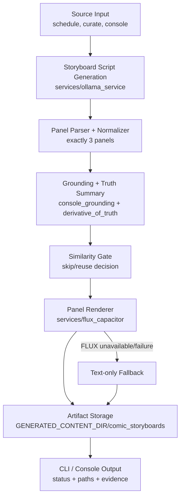
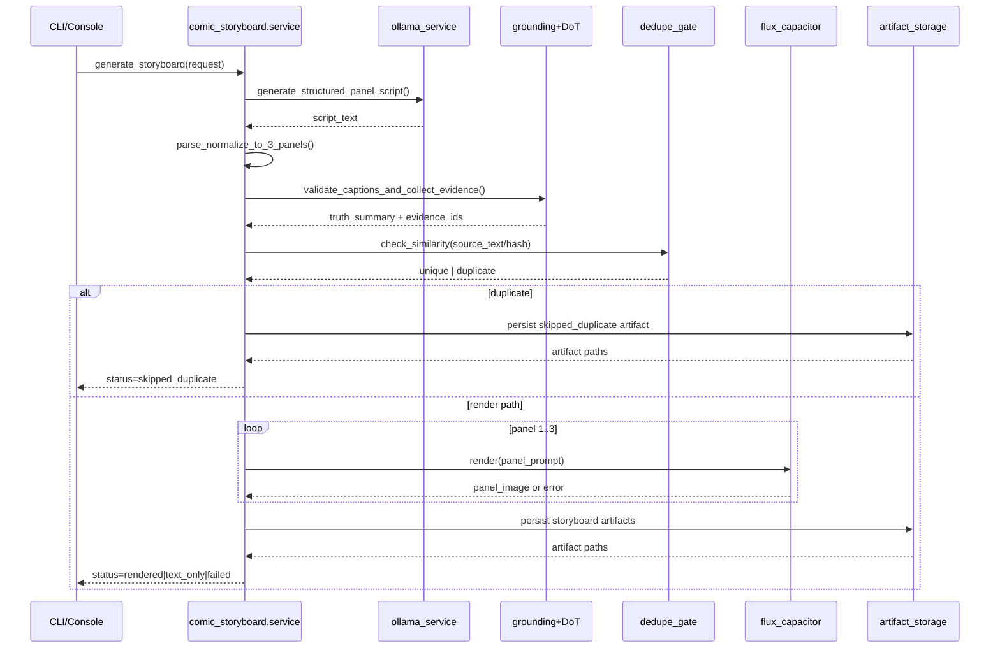

# Technical Design: Persona-Grounded Comic Storyboard Generator

## Summary

This design introduces a new storyboard subsystem that generates deterministic 3-panel comic artifacts from grounded SSI Booster content sources (`schedule`, `curate`, `console`).

The subsystem reuses existing local-first architecture:
- text generation via Ollama service
- grounding/truth via console grounding + Derivative of Truth
- image rendering via FLUX capacitor
- Docker-first runtime constraints with single-GPU orchestration

The core design goal is to add panelized storytelling without introducing a separate web subsystem or cloud-only dependency path.

## Mermaid Overview

## Goals

- Generate 3-panel storyboard artifacts from existing grounded content sources.
- Preserve explainability with panel-level evidence and truth metadata.
- Enforce deterministic fallback behavior (`rendered`, `text_only`, `failed`, `skipped_duplicate`).
- Keep implementation modular and aligned with package patterns used across services.
- Keep v1 CLI/console-first with no new Flask/SSE UI workflow.

## Non-Goals

- No web UI, templates, or streaming progress endpoint in v1.
- No variable panel count in v1 (fixed to 3).
- No speech-bubble compositing/OCR layout engine.
- No automatic channel-specific carousel publishing contract in v1.

## Existing Surfaces

This design integrates with:
- [main.py](../../../main.py)
- [services/ollama_service.py](../../../services/ollama_service.py)
- [services/flux_capacitor](../../../services/flux_capacitor)
- [services/console_grounding](../../../services/console_grounding)
- [services/derivative_of_truth](../../../services/derivative_of_truth)
- [services/selection_learning](../../../services/selection_learning)
- [docs/features/comic-storyboard-generator/prd.md](prd.md)

## Package Architecture

Create a new package:

- `services/comic_storyboard/__init__.py`
- `services/comic_storyboard/_config.py`
- `services/comic_storyboard/_models.py`
- `services/comic_storyboard/_prompting.py`
- `services/comic_storyboard/_parser.py`
- `services/comic_storyboard/_grounding.py`
- `services/comic_storyboard/_dedupe.py`
- `services/comic_storyboard/_render.py`
- `services/comic_storyboard/_storage.py`
- `services/comic_storyboard/service.py`

### Responsibilities

- `_config.py`: env-backed settings (thresholds, fallback mode, panel count fixed at 3).
- `_models.py`: dataclasses for request/result/panel/artifact metadata.
- `_prompting.py`: source-to-structured-script prompt assembly.
- `_parser.py`: robust parsing + normalization into exactly three panel payloads.
- `_grounding.py`: invoke truth/grounding checks and format evidence metadata.
- `_dedupe.py`: similarity checks against recent storyboard source hashes/text.
- `_render.py`: FLUX rendering orchestration with sequential panel rendering.
- `_storage.py`: local artifact persistence and sidecar metadata writes.
- `service.py`: high-level orchestration entrypoint for callers.

## Grizz-Inspired Design Patterns Adapted

Patterns adapted from reviewed Grizz modules:
- source-mode generator split with shared orchestration core
- explicit dedupe gate before expensive rendering
- strict panel normalization for malformed model output
- staged execution with deterministic status transitions
- image generation fallback chain and clear failure terminal states

Intentional adaptation differences for SSI Booster:
- Ollama-first local inference and Docker-first service assumptions
- truth-gated persona grounding as a hard requirement
- reuse FLUX capacitor instead of separate image service stack
- no Flask task registry or streaming response pipeline

## Data Contracts

### StoryboardRequest

Required fields:
- `request_id: str`
- `source_type: str` (`schedule|curate|console`)
- `source_reference: str`
- `source_text: str`
- `dry_run: bool`

Optional fields:
- `comic_style: str | None`
- `knowledge_context: str | None`
- `text_only: bool`
- `dot_report: bool`

### StoryboardPanel

Required fields:
- `panel_index: int` (1..3)
- `frame: str`
- `setting: str`
- `action: str`
- `dialogue: str`
- `caption: str`

### StoryboardResult

Required fields:
- `request_id: str`
- `status: str` (`rendered|text_only|failed|skipped_duplicate`)
- `panel_count: int`
- `panel_captions: list[str]` (len = 3)
- `panel_image_paths: list[str]` (len = 3 when rendered)
- `grounding_evidence_ids: list[str]`
- `truth_gradient_summary: dict`
- `artifact_dir: str`

Optional fields:
- `duplicate_of: str | None`
- `error_reason: str | None`
- `stage_timings_ms: dict[str, int]`

## Runtime Flow

1. Resolve source input from selected mode.
2. Generate structured 3-panel script through Ollama service.
3. Parse and normalize script into exactly 3 panels.
4. Ground captions and collect truth summary/evidence IDs.
5. Run dedupe gate against recent storyboard records.
6. If duplicate and policy says skip, persist skip artifact and return.
7. If text-only requested or FLUX unavailable, persist text-only artifact and return.
8. Render 3 panels sequentially through FLUX capacitor.
9. Persist image + JSON sidecar + summary artifact.
10. Return result payload to CLI/console caller.

## Mermaid Sequence

## Storage Design

Root:
- `${GENERATED_CONTENT_DIR}/comic_storyboards/<YYYY_MM_DD>/<storyboard_id>/`

Artifacts:
- `storyboard.json` (canonical contract)
- `panel_1.png`, `panel_2.png`, `panel_3.png` (if rendered)
- `captions.txt`
- `evidence.json`
- `run_meta.json` (status, timings, mode, fallback reasons)

Persistence rules:
- Always write `storyboard.json` and `run_meta.json` even on failure.
- Keep relative paths in metadata for portability.
- Include checksum/hash of source text for dedupe indexing.

## CLI and Console Integration

### CLI additions

Proposed flags:
- `--comic`
- `--comic-source schedule|curate|console`
- `--comic-style <name>`
- `--comic-text-only`
- `--comic-dot-report`

Example:
- `python main.py --comic --comic-source curate --dry-run`

### Console additions

Proposed command:
- `/comic [optional topic or source hint]`

Behavior:
- default source is most recent assistant response context
- optional topic refines panel script prompt

## Error Handling and Status Model

Terminal statuses:
- `rendered`: 3 images + metadata completed
- `text_only`: script/captions persisted, image rendering skipped/unavailable
- `skipped_duplicate`: duplicate detected and reuse/skip policy applied
- `failed`: unrecoverable generation failure, metadata persisted

Stage-level error policy:
- parsing failure -> retry normalization once, then fail
- grounding failure -> persist with warning; apply strict mode gate if configured
- panel render failure -> continue remaining panels, then determine final status

## Configuration

Proposed env variables:
- `COMIC_STORYBOARD_ENABLED=true|false`
- `COMIC_PANEL_COUNT=3` (validated fixed value in v1)
- `COMIC_DEDUPE_THRESHOLD=0.90`
- `COMIC_ALLOW_TEXT_ONLY_FALLBACK=true|false`
- `COMIC_RENDER_TIMEOUT_SECONDS=120`
- `COMIC_STORAGE_SUBDIR=comic_storyboards`

## Security and Compliance Considerations

- No new secrets required for baseline local mode.
- Reuse existing content sanitization before image prompt construction.
- Avoid storing raw sensitive prompts beyond current project artifact norms.
- Honor existing truth/grounding policy before marking output as publish-ready.

## Testing Strategy

Unit tests:
- parser normalization to exact 3 panels
- dedupe threshold logic
- fallback routing matrix
- storage contract completeness on all terminal statuses

Integration tests:
- CLI path wiring for `--comic` flows
- console command dispatch for `/comic`
- FLUX available vs unavailable behavior

Regression tests:
- ensure no breakage to existing schedule/curate/console paths when comic mode is off

## Rollout Plan

Phase 1:
- implement service package + text-only generation/persistence

Phase 2:
- integrate FLUX rendering sequential panel pipeline

Phase 3:
- wire CLI and console commands + docs updates

Phase 4:
- add dedupe and optional selection-learning signal hooks

## Open Design Questions

1. Should duplicate policy default to hard skip or soft reuse (return prior artifact id)?
2. Should grounding strictness for comic captions match post strictness by default?
3. Should comic artifacts be eligible for future Buffer media attachment pipeline in v2?
