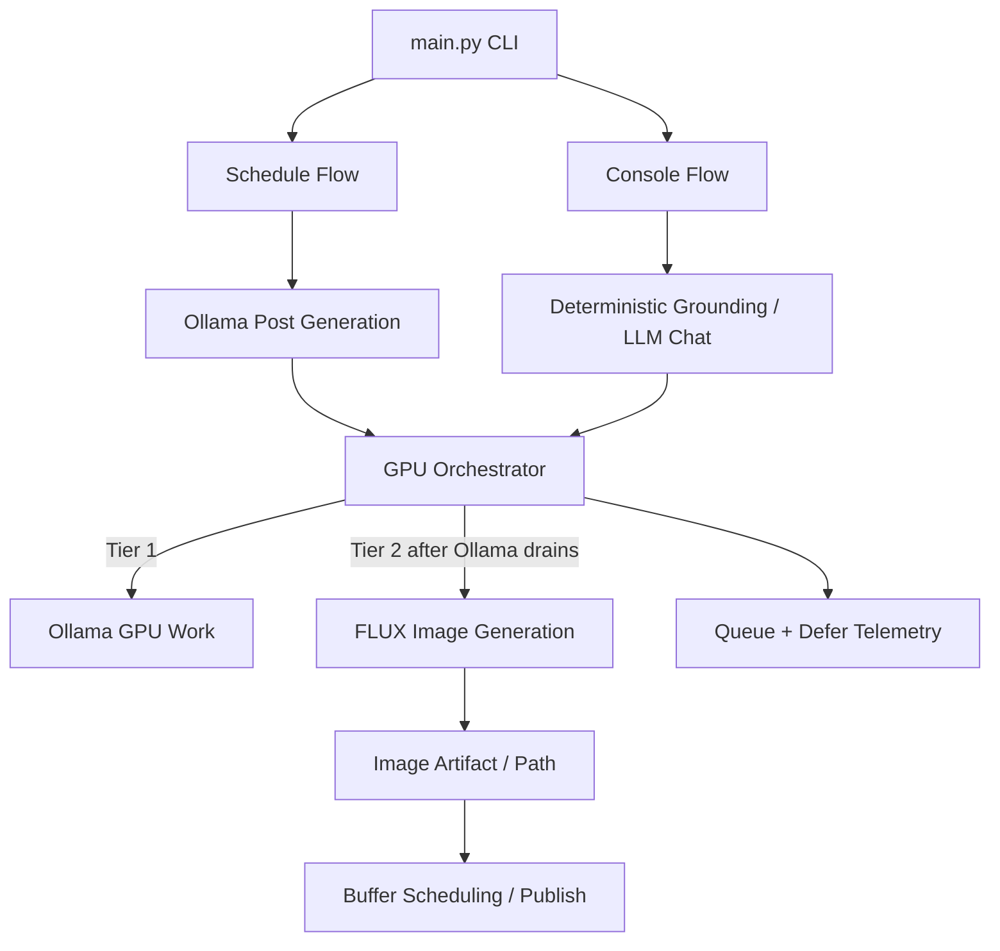
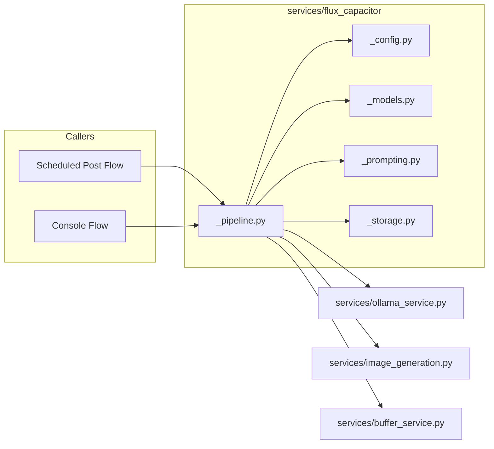
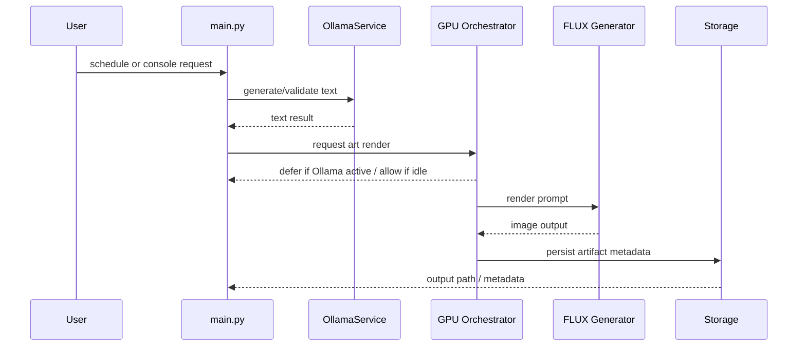

# Technical Design: FLUX Art Avatar After Ollama

## Summary
This feature adds a new FLUX-based art avatar subsystem that transforms the project from text-first content generation into a multimodal avatar platform. The avatar is intentionally restrained: a minimalist corporate-art hybrid with subtle geometry, muted palette, and low-surreal intensity.

The defining technical constraint is single-GPU sequencing on the RTX 3060. Ollama remains the first-class GPU consumer. FLUX generation must be deferred until Ollama work has completed, and FLUX must never run concurrently with active Ollama GPU work.

Generated-content persistence is treated as a platform-level architecture rule. This design applies it to the avatar path while keeping compatibility with non-avatar generated content flows.

## Mermaid Overview


## Goals
- Add a dedicated art avatar layer without disrupting existing text generation.
- Reuse the Rei Toei modular pattern for package design and runtime configuration.
- Make FLUX generation safe on a single 3060 by serializing all GPU work.
- Support both scheduled content generation and interactive console use.
- Keep output visually distinctive but deliberately toned down.
- Persist generated story text per story as local artifacts so manual-first publishing is reproducible.
- Enforce persistence alignment with a whole-system generated-content contract (local first, DB second).

## Non-Goals
- No multi-GPU scheduler.
- No replacement of the existing Ollama service.
- No redesign of the FLUX model stack.
- No new public-facing web UI for the feature.
- No change to Buffer as the publishing backend.

## Existing Surfaces
The implementation builds on these existing surfaces:
- [main.py](../../../main.py) for CLI and console entrypoints.
- [services/ollama_service.py](../../../services/ollama_service.py) for all LLM calls.
- [services/image_generation.py](../../../services/image_generation.py) for FLUX inference.
- `flux_capacitor` as the documented FLUX runtime/deployment service name in Docker-facing docs.
- [services/rei_toei](../../../services/rei_toei) as the modular reference for a dedicated avatar service package.
- [.github/copilot-instructions.md](../../../.github/copilot-instructions.md) for repo conventions.
- [README.md](../../../README.md) and [docs/testing-and-dev.md](../../testing-and-dev.md) for user-facing and developer-facing updates.

## Feature Scope and Trigger Matrix
This feature does not add a new top-level CLI command. It extends the existing workflows with art-avatar behavior when those workflows already produce content that should be visualized.

Planned triggers:
- `--schedule`: primary image-aware path; generate text first, then request FLUX rendering.
- `--console`: optional art-avatar-aware conversational path for on-demand artwork or explanation.
- `--curate`: intentional path for curated Buffer ideas and concept art that should be visualized before publishing.

Routing rules:
- If the caller does not request art-avatar output, the feature remains inert.
- If the caller requests art-avatar output while Ollama is active, the request is deferred behind the GPU gate.
- If the GPU wait exceeds threshold, the caller receives a text-only or deferred result instead of a hard failure.

## Architecture
### System Boundary
The feature lives primarily in a new package, `services/flux_capacitor/`, that sits between caller surfaces and the actual FLUX image generator. It does not own post scheduling or console orchestration; instead, it acts as a policy-aware image pipeline that can be invoked from both the scheduled and console paths.

Generated story text persistence is part of this system boundary for this feature release. Story text artifacts are produced in the same local-first workflow as image artifacts, then handed to downstream manual or automated publish steps.

System contract note:
- avatar storage logic is an implementation of the repository-wide generated-content persistence contract
- the avatar module must not become an isolated persistence silo

### Component Model
- `services/flux_capacitor/_config.py`
  - Feature flags, style clamps, queue thresholds, and GPU policy values.
- `services/flux_capacitor/_models.py`
  - Request/result models, style presets, queue state, and telemetry payloads.
- `services/flux_capacitor/_prompting.py`
  - Prompt assembly and tone constraints.
- `services/flux_capacitor/_pipeline.py`
  - Orchestration, GPU gate integration, and sequencing logic.
- `services/flux_capacitor/_storage.py`
  - Artifact paths, metadata persistence, and style template storage.
- `services/flux_capacitor/__init__.py`
  - Stable public API for callers.

### Mermaid Component Diagram


## Runtime Flow
### Scheduled Flow
1. The existing schedule path generates post text with Ollama.
2. The post passes existing grounding, truth, and confidence checks.
3. The art avatar pipeline receives a render request only after the Ollama work is complete.
4. The GPU orchestrator grants access to FLUX only when no higher-priority Ollama job is active.
5. The generated image is attached to the scheduled artifact and routed onward.
6. The generated story text is saved as a local artifact with metadata linking it to the render request.

### Console Flow
1. The console route continues to handle deterministic grounding, learned knowledge, and general chat.
2. When the user asks for avatar-related artwork or an art-avatar-capable command path is selected, the art avatar pipeline is invoked.
3. The same GPU orchestrator is used, with Ollama priority preserved.
4. If the GPU is busy, the feature can return a deferred or text-only response rather than blocking the session indefinitely.
5. Any generated story output is saved locally with request metadata for later manual upload/reuse.

### Mermaid Sequence


## Data Model
### ArtAvatarRequest
Represents a render request from schedule or console.

Required fields:
- `request_id`
- `source_mode` (`schedule` or `console`)
- `post_text` or `concept_text`
- `style_profile`
- `ollama_priority_context`
- `requested_at`

Optional fields:
- `theme`
- `channels`
- `target_width`
- `target_height`
- `defer_if_busy`
- `max_wait_seconds`
- `source_post_id`
- `source_channel`
- `knowledge_context`
- `prompt_overrides`
- `style_overrides`

### ArtAvatarResult
Represents the outcome of a render request.

Required fields:
- `request_id`
- `status` (`rendered`, `deferred`, `text_only`, `failed`)
- `prompt_text`
- `image_path` if rendered
- `telemetry`
- `evidence_ids`

Optional fields:
- `metadata_path`
- `defer_reason`
- `wait_time_seconds`
- `gpu_job_id`
- `fallback_text`

### StylePreset
A small preset object constraining the aesthetic.

Fields:
- `name`
- `palette`
- `geometry_density`
- `saturation_cap`
- `surreal_intensity_cap`
- `prompt_suffix`

### GPUPolicy
A config object controlling RTX 3060 behavior.

Fields:
- `ollama_first`
- `flux_after_ollama`
- `max_concurrent_gpu_jobs`
- `queue_wait_timeout_seconds`
- `defer_to_text_only_after_timeout`
- `flux_render_width`
- `flux_render_height`
- `flux_steps`

## Artifact Storage Design
Rendered output and generated story text should be persisted as local artifacts plus metadata records.

This artifact design represents a system-wide pattern for generated content and should be reused by other generation surfaces where possible.

Recommended layout:
- Generated-content root directory: `GENERATED_CONTENT_DIR` (default `yt-vid-data/`) as the single local-first storage root.
- Image output directory: `<GENERATED_CONTENT_DIR>/images/` or `<GENERATED_CONTENT_DIR>/flux_capacitor/` for art-avatar artifacts.
- Metadata sidecar: JSON record next to each render, containing request ID, prompt summary, style preset, wait/defer data, and evidence IDs.
- Story output directory: `<GENERATED_CONTENT_DIR>/stories/` (or channel-scoped subfolders such as `<GENERATED_CONTENT_DIR>/youtube_scripts/`) with one file per generated story.
- Story metadata sidecar: JSON record linking story file, image file, channel, run ID, and request ID.
- Deterministic naming: include feature prefix, timestamp, and short hash to avoid collisions.

Current implementation note:
- the generated-content root is already used for some text/script artifacts in the repository
- the dedicated FLUX art-avatar image subdirectory convention described here is design intent for this feature and is not fully implemented yet

The storage layer should not require a remote service. It should be able to write locally and hand back a path that downstream scheduling code can attach to the post payload or Buffer media workflow.

### Story Artifact Contract
Each generated story should persist:
- full text body (not snippet-only)
- channel and mode (`schedule`, `curate`, `console`)
- source reference (article URL/title when applicable)
- linkage to image artifact path when rendering occurs
- linkage to request/result IDs for deterministic traceability

Save failures should be explicit in the result status and must not silently discard generated content.

### System-Wide Generated Content Contract
The repository-level expectation is:
- generated outputs are durably saved as local artifacts first
- metadata provides deterministic traceability to runs/requests/channels
- media and text linkage is preserved when both exist
- snippet-only telemetry tables are not treated as canonical generated-content archives

Avatar implementation requirement:
- `services/flux_capacitor` must conform to this contract and be interoperable with existing non-avatar generated-content save behavior.

## Configuration Design
The feature should expose environment-driven configuration in `.env.example` and `services/flux_capacitor/_config.py`.

Recommended variables:
- `FLUX_CAPACITOR_ENABLED`
- `FLUX_CAPACITOR_STYLE_PRESET`
- `FLUX_CAPACITOR_MINIMAL_MODE`
- `FLUX_CAPACITOR_OLLAMA_FIRST`
- `FLUX_CAPACITOR_FLUX_AFTER_OLLAMA`
- `FLUX_CAPACITOR_MAX_CONCURRENT_GPU_JOBS`
- `FLUX_CAPACITOR_QUEUE_WAIT_TIMEOUT_SECONDS`
- `FLUX_CAPACITOR_RENDER_WIDTH`
- `FLUX_CAPACITOR_RENDER_HEIGHT`
- `FLUX_CAPACITOR_RENDER_STEPS`
- `FLUX_CAPACITOR_SATURATION_CAP`
- `FLUX_CAPACITOR_GEOMETRY_DENSITY_CAP`
- `FLUX_CAPACITOR_SURREAL_INTENSITY_CAP`

Policy defaults should reflect the RTX 3060 constraint:
- One active GPU job at a time.
- Ollama gets priority over FLUX.
- FLUX may defer rather than compete.
- If the queue is saturated too long, the system should degrade cleanly to text-only output.

Deployment/profile behavior:
- `core` profile should keep the text pipeline available and disable art-avatar rendering unless the FLUX runtime is present.
- `full` profile should enable FLUX and allow the art-avatar feature to render when policy allows.
- The design should preserve a safe degraded state when the GPU stack is unavailable: text generation still works, art rendering does not block the workflow.

## Prompt and Style Design
The avatar should not imitate the high-intensity visual language of the original Alex Grey reference. Instead, it should use:
- muted contrast
- shallow sacred-geometry hints
- restrained symmetry
- polished but corporate-safe composition
- low surreal intensity

Prompt generation should combine:
- the post or concept text
- relevant theme or channel cues
- optional knowledge context from the active run
- the selected style preset
- explicit negative constraints to suppress over-saturation or excessive visual complexity
- image dimension and step settings tuned for the 3060

The prompt builder should treat style constraints as hard limits rather than soft suggestions.

## GPU Sequencing Design
The core design choice is to treat the single 3060 as a shared, serialized resource.

Priority order:
1. Ollama jobs
2. FLUX jobs

Behavior:
- FLUX requests wait behind any active Ollama work.
- FLUX requests can be deferred if queue pressure exceeds threshold.
- Deferred FLUX requests may return a text-only completion path so the user workflow does not stall.
- Telemetry should record wait duration, defer count, and completion outcomes for tuning.

This is a policy gate, not a separate service. Keeping the gate in-process simplifies the first release and matches the existing local-first runtime.

The gate should expose a clear outcome contract:
- `allowed`: FLUX may begin now.
- `deferred`: FLUX should wait and retry or fall back.
- `text_only`: do not render; return the non-image result path.

The design should not assume background retry infrastructure. Any retry behavior must remain bounded and explicit.

## Error Handling
The design should explicitly handle:
- missing or invalid art-avatar config
- FLUX model load failures
- queue timeouts
- Ollama service unavailability
- image save failures
- story text save failures
- unsupported or malformed art-avatar requests
- missing FLUX runtime in `core` profile
- storage directory creation failures
- malformed style overrides from callers

Expected failure semantics:
- Validation failures should raise `ValueError` early.
- GPU contention should produce a deferred or text-only result, not a crash.
- Render failures should log a structured error and preserve the primary text result when possible.

## Performance Considerations
The RTX 3060 is the hard limit, so the design should favor predictability over throughput.

Performance tactics:
- one active GPU task only
- CPU work for prompt assembly and metadata should stay outside the gate
- use a small number of FLUX inference steps
- keep image dimensions conservative for stability
- allow future downgrade logic for steps or size if memory pressure is observed

## Security and Safety Considerations
- Keep all configuration local and environment-driven.
- Do not log secrets or raw environment values.
- Preserve existing Buffer and Ollama boundaries.
- Prevent prompt escalation into overly intense or unsafe visual language through hard clamps.
- Maintain deterministic file output paths and metadata storage.
- Keep prompt text, evidence IDs, and metadata local unless the existing Buffer flow explicitly requires upload.
- Keep generated story text local by default and avoid introducing remote dependencies for baseline operation.

## Database Schema Fit Review (DB Second)
Review of [services/database/models.py](../../../services/database/models.py):
- `CandidateRecord` is designed for selection learning and stores `text_snippet`, not full generated story bodies.
- `PublishedRecord` also stores `text_snippet` and publish linkage metadata.
- Current schema supports analytics/reconciliation, but does not represent a full local-story archive by itself.

Conclusion:
- For this feature, schema fit is partial. It is sufficient for secondary indexing and feedback loops, not for complete generated-content archival.

DB-second design rule:
- Local artifact files remain the source of truth.
- Database writes are optional secondary mirrors/indexes.

System implication:
- this rule applies to generated content across the system, not only art-avatar artifacts.

If full-story DB archival is needed, add a migration-backed extension:
- Option A: add `full_text` and artifact linkage columns to `candidate_records`.
- Option B (preferred): add a dedicated `generated_content_records` table linked by run/request/candidate identifiers.

Migration instructions should include:
- additive schema change only (no destructive rewrite)
- backfill from local artifacts where available
- dual-write period (local + DB) before relying on DB queries
- rollback path that preserves local artifacts as canonical store

## CLI and Console Coverage
### CLI Coverage
The existing CLI already exposes the relevant top-level surfaces:
- `--schedule`
- `--curate`
- `--console`
- `--avatar-explain`
- `--dot-report`
- `--interactive`
- `--dry-run`

This feature should integrate into the current CLI flows rather than adding a new primary command surface. The design should explicitly document:
- schedule path image generation after Ollama text generation
- curated-idea image generation before Buffer publish decisions when the curation flow selects art-avatar output
- optional art-avatar behavior for console-driven requests
- a fallback path when GPU pressure is too high
- any future `--avatar-*` flags should be introduced only if the feature needs explicit user control beyond the existing workflow triggers

### Console Coverage
The console already supports deterministic grounding and Rei Toei routing. The art avatar feature should extend the console experience by:
- allowing art-avatar-aware prompts or commands
- optionally showing validation metadata for generated art
- honoring the same GPU gate as scheduled jobs

### Coverage Verdict
The current design now covers the first-release scope, with `--schedule`, `--curate`, and `--console` integrated.

The CLI/console integration contract is now explicit enough for implementation: it defines trigger points, fallback behavior, and the non-goal of new top-level commands.

## Test Design
Required test coverage:
- request validation and style clamp tests
- GPU policy parsing tests
- queue ordering tests with mocked Ollama and FLUX work
- schedule flow integration tests
- console flow integration tests
- timeout and defer tests
- render-path metadata persistence tests
- CLI argument-routing tests for existing command combinations

Recommended test file layout:
- `tests/test_flux_capacitor_pipeline.py`
- `tests/test_gpu_orchestration_policy.py`
- `tests/test_flux_capacitor_console_integration.py`
- `tests/test_flux_capacitor_schedule_integration.py`
- `tests/test_flux_capacitor_cli_routing.py`

Required validation commands:
```bash
python -m py_compile services/flux_capacitor/__init__.py services/flux_capacitor/_config.py services/flux_capacitor/_models.py services/flux_capacitor/_prompting.py services/flux_capacitor/_pipeline.py services/flux_capacitor/_storage.py
pytest -q tests/test_flux_capacitor_pipeline.py tests/test_gpu_orchestration_policy.py
```

## Rollout Plan
1. Add the package skeleton and models.
2. Add the GPU policy and gate.
3. Wire schedule integration.
4. Wire console integration.
5. Add style presets and prompt constraints.
6. Add telemetry and fallback behavior.
7. Add tests.
8. Update docs.

## Implementation Notes
- Follow the Rei Toei pattern of lazy-loaded config and service orchestration.
- Keep art-avatar logic isolated from the core post-generation code path except for the explicit integration points.
- Avoid making FLUX prompt logic depend directly on main.py; main should only route and pass inputs.
- Keep the first release simple: in-process gate, local persistence, no distributed scheduler.

## Open Questions
- Should a deferred render be retried automatically or only on the next user-triggered action?

## Documentation Targets
Update these docs when implementation begins:
- [README.md](../../../README.md)
- [docs/multimodal-features.md](../../multimodal-features.md)
- [docs/testing-and-dev.md](../../testing-and-dev.md)
- [docs/docker-deployment.md](../../docker-deployment.md)
- [docs/cli-reference.md](../../cli-reference.md)

## Outcome
When complete, the project will have a dedicated, policy-controlled art avatar subsystem that can generate toned-down FLUX artwork from scheduled content or console interactions while protecting Ollama priority on the only GPU.
