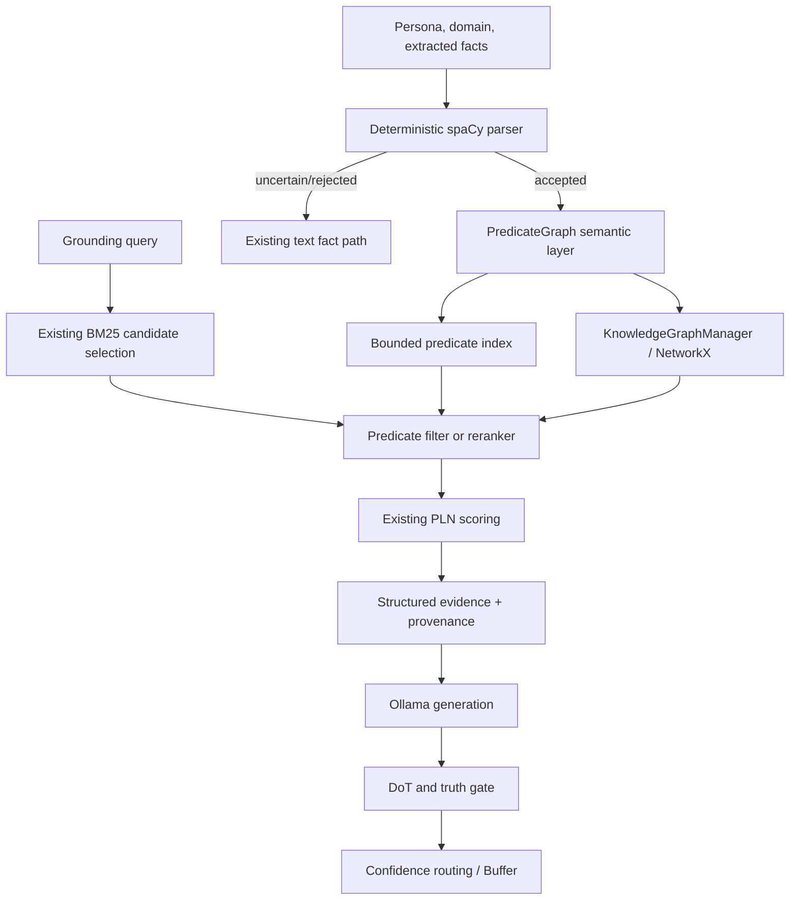
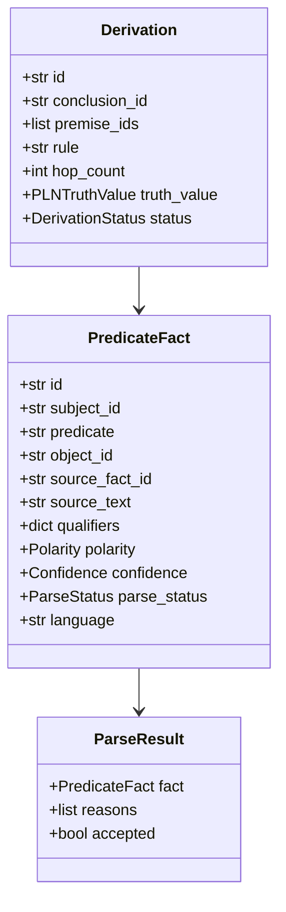
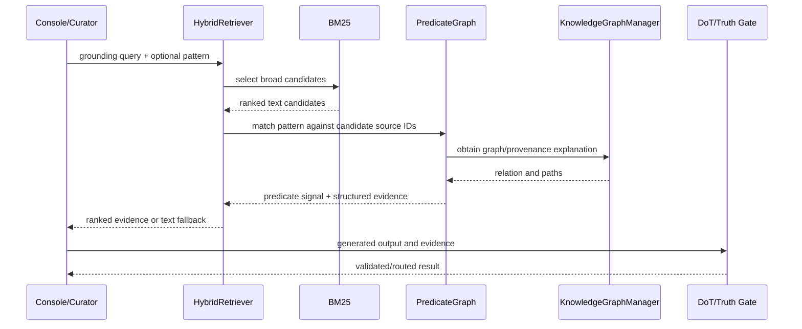

# Technical Design: Typed Predicate Knowledge Graph

## Summary

Add a conservative predicate-semantic layer beside the existing NetworkX
knowledge graph. The layer converts selected source facts into validated,
serializable `PredicateFact` records, indexes those records for bounded pattern
queries, and records explicitly supported one-hop/two-hop derivations. Existing
text facts, BM25 retrieval, graph scoring, DoT, PLN, and the truth gate remain
authoritative fallback and validation paths.

## Architecture Overview



The new layer is an adapter around existing evidence, not a second graph
database. The parser may abstain. Querying may fall back to the original
candidate text. Inference produces reviewable candidates and never mutates
first-party persona truth automatically.

## Component Design

### `services/predicate_graph/`

Create a focused package following existing private-module conventions:

- `_models.py`: frozen or immutable-friendly dataclasses, enums, and validation.
- `_parser.py`: deterministic spaCy dependency-pattern extraction and abstention.
- `_normalization.py`: entity IDs, predicate vocabulary, qualifier extraction.
- `_storage.py`: serialization, reload, and indexes for accepted facts/derivations.
- `_query.py`: bounded pattern matching and evidence formatting.
- `_inference.py`: explicit rules, hop limits, and PLN delegation.
- `_contradictions.py`: configured review candidates with scope checks.
- `__init__.py`: small public API and backward-compatible exports.

The package owns semantic records and indexes. `KnowledgeGraphManager` remains
the owner of graph nodes, edges, graph proximity, claim support, and existing
graph persistence. Integration should use a narrow adapter rather than adding
reasoning responsibilities to the graph manager.

### Parser

`parse_statement(statement, source_fact_id, metadata)` returns a `ParseResult`:

1. Normalize whitespace and retain the exact source statement.
2. Use spaCy entities, noun chunks, dependency subjects/objects, auxiliaries,
   negation, and numeric/version spans.
3. Accept only configured predicate patterns with resolvable subject and
   predicate; require an object unless the pattern is a property/value fact.
4. Emit qualifiers and a confidence estimate based on parse signals.
5. Return `uncertain` with reason codes for coordination, unresolved pronouns,
   implicit arguments, unsupported comparison, or ambiguous attachment.

The parser does not call Ollama. An optional future suggestion layer may propose
alternatives, but validation and provenance must still be performed locally.

### Predicate vocabulary and normalization

Start with a small allowlist such as `improved`, `supports`, `has_feature`,
`has_version`, `located_in`, and `has_property`. Normalize aliases to one
canonical predicate, lowercase predicate tokens, and reject arbitrary grammar
strings. Entity normalization should preserve distinctions such as `Python`,
`Python 3.12`, and `CPython` until an explicit alias rule exists.

## Data Model



`object_id` is nullable for subject-property-value records. Qualifiers are a
bounded dictionary with reserved keys: `version`, `numeric`, `time`, `source`,
`scope`, `degree`, `comparison_target`, and `language`. Unknown qualifier keys
are rejected or preserved only in an explicitly marked extension field.

Use string enums for `positive`/`negative`, `accepted`/`uncertain`/`rejected`,
and `direct`/`derived`/`review`. Confidence describes extraction or evidence
weight, never objective truth. A predicate fact must contain `source_text` and
`source_fact_id`; a derivation must contain premise IDs and a rule.

## Graph and Storage Integration

For an accepted fact, the adapter:

1. Calls `KnowledgeGraphManager.add_fact()` for the original fact as today.
2. Adds or reuses entity nodes for `subject_id` and `object_id`.
3. Adds a claim/event node when qualifiers require identity beyond a binary edge.
4. Adds a canonical predicate edge with metadata containing `predicate_fact_id`,
   polarity, qualifiers, parse status, and source fact ID.
5. Stores the complete serialized `PredicateFact` and any `Derivation` in an
   additive predicate artifact or graph metadata namespace.

The first implementation should use a separate JSON artifact next to the
existing graph artifact, because it permits atomic replacement, schema versioning,
and rollback without rewriting persona/domain packs. The storage module must
support missing artifacts as an empty semantic layer. PostgreSQL tables can be
added later after file behavior and migration needs are demonstrated.

Serialization must include a schema version, records, derivations, and indexes
or be able to rebuild indexes deterministically on load. Writes should use a
temporary file followed by an atomic rename. Invalid records fail validation and
are logged without corrupting existing text knowledge.

## Retrieval Flow

`HybridRetriever.find_facts()` remains the public broad-recall path. Add an
optional predicate pattern parameter at the narrowest compatible boundary, or
introduce a companion method if changing the signature would affect callers.



Predicate matching must not search the entire graph for every query when BM25
has already produced candidates. Use source-fact IDs and an in-memory index by
predicate and subject. If the pattern has no match, preserve the existing BM25
plus graph result. Structured evidence is an annotation on the result, not a
replacement for the original fact text.

## Bounded Inference

`_inference.py` accepts explicit premise IDs and a named rule from a configured
allowlist. The MVP supports only two-premise deduction:

```text
A --predicate_1--> B
B --predicate_2--> C
            => A --derived_predicate--> C
```

Rules must declare compatible predicates and output predicate. The engine rejects
cycles, more than two hops, missing premises, uncertain/rejected premises, and
qualifier conflicts. It calls `pln_deduction()` and stores the resulting
`PLNTruthValue` without converting it to a direct fact. Independent evidence may
use `pln_revision()` in a separate, explicit operation.

Derived evidence is marked `derived` and receives a lower or explicitly revised
confidence. Generation context must label it as inferred and include all source
premises. It cannot enter persona claims or Buffer output without the existing
review/confidence/truth-gate path.

## Contradiction Review

The contradiction detector compares accepted direct facts sharing a normalized
subject and predicate, then applies a configured incompatibility table. It emits
`ContradictionCandidate` only when polarity/value conflict remains after checking
time, scope, comparison target, workload, and source qualifiers.

Candidates contain both fact IDs, a reason code, missing-context indicators, and
source links. No fact is deleted, revised, blocked, or labeled objectively false.
Derived facts are excluded from the first contradiction pass to avoid cascading
uncertainty.

## Grounding and Explainability

Add a formatter that emits structured evidence alongside existing text:

```text
subject: Python 3.12
predicate: improved
object: async performance
source_fact_id: article-42
source_text: ...
confidence: medium
parse_status: accepted
provenance: article URL
```

`explain(conclusion_id)` returns direct source records for a fact or premise,
rule and hop metadata for a derivation, graph paths from the existing manager,
and DoT/PLN annotations where present. Explanation output is diagnostic and
must not be treated as a proof.

## Error Handling and Observability

- Invalid input models raise `ValueError` at the boundary with a stable reason.
- Parser abstention returns a normal `ParseResult`; it is not an exception.
- Missing optional NetworkX, graph, or predicate artifacts uses text fallback
  and emits a debug/warning log appropriate to the failure.
- Corrupt predicate artifacts are quarantined or skipped after logging; existing
  source facts remain loadable.
- Log parse acceptance counts, abstention reason counts, query match/fallback
  counts, derivation rejections, and contradiction candidate counts.
- Never log secrets or full private source content at info level.

## Testing and Evaluation

Add focused pytest modules for models, parser fixtures, storage reload, graph
integration, query matching, hybrid fallback, inference limits, contradiction
review, and explanation formatting. Mock spaCy where appropriate but retain a
small integration fixture using the configured model when available.

Required behavioral checks include active/passive voice, negation, coordination,
qualifiers, ambiguous abstention, stable IDs, missing artifact fallback, one-hop
and two-hop derivation, confidence degradation, qualifier conflict rejection,
false contradiction avoidance, and truth-gate preservation.

Benchmark parser acceptance/precision on a reviewed fixture set and compare
predicate-aware retrieval against the current BM25-plus-graph baseline. Record
results in the feature documentation; do not establish latency SLOs before the
actual graph-size benchmark exists.

## Rollout and Compatibility

Ship parsing and semantic storage behind an additive feature flag or explicit
construction option defaulting to current behavior. Backfill only a reviewed
subset of facts initially. Enable predicate reranking after parser precision and
fallback tests pass. Enable derivation and contradiction reports only after their
review output is demonstrably useful.

Rollback consists of disabling semantic extraction/reranking and ignoring the
predicate artifact; existing facts, graph data, and generated-content workflows
remain usable. Document the artifact schema version and migration/rollback path
before enabling persistence in production-like runs.
