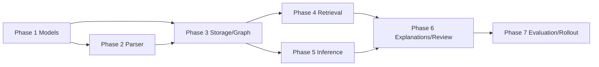

# Implementation Plan: Typed Predicate Knowledge Graph

## Overview

Implement an additive semantic layer over the existing NetworkX knowledge graph.
The implementation will begin with validated models and deterministic extraction,
then add persistence, BM25-first pattern retrieval, bounded PLN derivation,
contradiction review, and structured explanations. Existing text facts, domain
packs, graph scoring, DoT, truth-gate validation, and Buffer routing remain
usable throughout the rollout.

**Status:** Not started  
**Target:** MVP semantic layer with measured parser/retrieval behavior  
**Primary design:** [design.md](./design.md)  
**Requirements:** [prd.md](./prd.md)

## Project Integration Summary

- `services/predicate_graph/`: new focused semantic package and public API.
- `services/knowledge_graph.py`: existing NetworkX nodes, edges, proximity,
  support scoring, persistence, and explanation paths.
- `services/avatar_intelligence/_extraction.py`: existing source-fact pipeline;
  semantic extraction remains additive to ordinary text storage.
- `services/hybrid_retriever.py`: BM25 remains the broad candidate selector;
  predicate signals apply afterward.
- `services/spacy_nlp.py`: deterministic dependency/entity signals.
- `services/pln_inference.py`: existing `PLNTruthValue`, deduction, and revision.
- DoT and console truth gate: independent validation after generation.
- Domain packs and optional PostgreSQL: unchanged in the MVP.

## Pre-Implementation Checklist

- [ ] Confirm the current Python environment and baseline focused/full test status.
- [ ] Review existing graph serialization and artifact paths before selecting the
      predicate artifact location.
- [ ] Identify the first reviewed source-fact fixture set and expected parses.
- [ ] Decide the initial predicate allowlist and entity-ID normalization rules.
- [ ] Confirm whether spaCy model availability is required or optional in tests.
- [ ] Define the feature flag/construction option defaulting to current behavior.
- [ ] Record baseline BM25-plus-graph retrieval results for comparison.

## Implementation Phases

### Phase 1: Models, vocabulary, and validation

**Goal:** Establish a stable, serializable semantic contract before parsing or
graph integration.

**Tasks:**

- [ ] Create `services/predicate_graph/` and its `__init__.py` public exports.
- [ ] Implement `_models.py` with typed dataclasses for `PredicateFact`,
      `ParseResult`, `PredicatePattern`, `Derivation`, `DerivationResult`, and
      `ContradictionCandidate`.
- [ ] Add string enums for polarity, parse status, evidence status, and
      derivation status.
- [ ] Validate non-empty IDs, canonical predicates, nullable object semantics,
      qualifier keys, and required provenance fields.
- [ ] Define stable reason codes for parser abstention and rejected operations.
- [ ] Implement `_normalization.py` with the initial predicate allowlist,
      alias mapping, whitespace normalization, and conservative entity IDs.
- [ ] Add `language`/script metadata without adding Japanese parsing behavior.

**Verification:**

- [ ] Add `tests/test_predicate_models.py` for valid records, invalid records,
      nullable objects, absent-vs-negative semantics, and round-trip conversion.
- [ ] Add parametrized tests for predicate aliases and entity distinctions such
      as `Python`, `Python 3.12`, and `CPython`.
- [ ] Run `source .venv/bin/activate && python -m pytest -q tests/test_predicate_models.py`.
- [ ] Run `source .venv/bin/activate && python -m py_compile services/predicate_graph/*.py`.

**Traceability:** PRD FR-1, NFR determinism/auditability; design Data Model and
Predicate Vocabulary sections.

### Phase 2: Deterministic extraction and abstention

**Goal:** Parse a small reviewed English fixture set conservatively using the
existing spaCy boundary, while retaining text-only fallback.

**Tasks:**

- [ ] Implement `_parser.py` with a parser interface accepting statement,
      source fact ID, metadata, and optional language.
- [ ] Extract dependency subject, predicate, object, negation, entities,
      noun chunks, numeric/version spans, and qualifier candidates.
- [ ] Implement only configured active/passive and property/value patterns.
- [ ] Mark unsupported coordination, pronouns, implicit arguments, ambiguous
      attachments, and comparative/casual language as uncertain or rejected.
- [ ] Preserve exact source text, source fact ID, source URL, and parser reasons.
- [ ] Ensure parsing never calls Ollama and never promotes uncertain output to
      accepted high-confidence evidence.
- [ ] Add an extraction adapter callable from the existing fact pipeline without
      changing how ordinary facts are stored.

**Verification:**

- [ ] Add reviewed fixtures for active voice, passive voice, negation,
      coordination, version/numeric/time qualifiers, and ambiguity.
- [ ] Assert accepted parse precision and abstention behavior separately.
- [ ] Test missing spaCy/model behavior as a graceful text-only fallback.
- [ ] Run focused parser tests and `py_compile` on changed Python files.

**Traceability:** PRD US-1, FR-2, NFR safety/language boundary; design Parser.

### Phase 3: Additive storage and graph integration

**Goal:** Persist accepted semantic facts without changing existing graph or
domain-pack behavior.

**Tasks:**

- [ ] Implement `_storage.py` with a versioned JSON artifact containing
      predicate facts, derivations, and rebuildable indexes.
- [ ] Select and document the artifact path using existing avatar/data path
      conventions; missing artifact means an empty semantic layer.
- [ ] Write through a temporary file and atomic rename; reject invalid records
      without corrupting the prior artifact.
- [ ] Add a narrow graph adapter that calls existing `add_fact()` and
      `link_entities()` rather than duplicating NetworkX behavior.
- [ ] Reuse source fact/entity IDs where possible; add claim/event nodes only
      when qualifier identity requires them.
- [ ] Store predicate metadata on canonical edges, including semantic ID,
      polarity, qualifiers, parse status, and source fact ID.
- [ ] Implement reload and deterministic index rebuilding.
- [ ] Add feature-disabled/default behavior that does not parse or rerank facts.

**Verification:**

- [ ] Add storage round-trip, schema-version, missing-artifact, corrupt-artifact,
      atomic-write, and invalid-record tests.
- [ ] Add graph integration tests for node/edge metadata, source links,
      explanation paths, and repeated ingestion.
- [ ] Verify existing domain packs and graph tests pass unchanged.
- [ ] Run focused tests, then the existing knowledge-graph test module.

**Traceability:** PRD US-1, FR-3, NFR backward compatibility/auditability;
design Graph and Storage Integration.

### Phase 4: Predicate pattern retrieval

**Goal:** Add precise semantic matching after broad BM25 candidate selection,
with no loss of existing fallback behavior.

**Tasks:**

- [ ] Implement `_query.py` for bounded subject, predicate, object, polarity,
      and supported qualifier filters.
- [ ] Index accepted facts by predicate, subject, object, and source fact ID.
- [ ] Match only against BM25 candidate source IDs when candidates are supplied;
      avoid whole-graph scans per query.
- [ ] Add an optional pattern boundary to `HybridRetriever` or a companion method
      if changing `find_facts()` would risk callers.
- [ ] Apply predicate matches as a filter/reranking signal after BM25 and graph
      scoring; preserve current scoring when no pattern is provided.
- [ ] Format structured evidence with source text, provenance, qualifiers,
      confidence, and parse status.
- [ ] Add diagnostic score/explanation fields without changing existing result
      types unless a compatibility adapter is required.

**Verification:**

- [ ] Test exact subject/predicate/object matches and wildcard patterns.
- [ ] Test polarity and qualifier filtering, no-match behavior, and text-only
      fallback for uncertain/unparsed facts.
- [ ] Compare representative retrieval results with the baseline and record
      precision/recall observations.
- [ ] Run hybrid retriever tests and relevant avatar retrieval tests.

**Traceability:** PRD US-2, US-5, FR-4, FR-7, Success Metrics 3/7; design
Retrieval Flow.

### Phase 5: Bounded PLN inference

**Goal:** Produce explicit, reviewable one-hop/two-hop conclusions without
promoting them to direct facts or persona claims.

**Tasks:**

- [ ] Implement `_inference.py` with a named rule allowlist and compatible
      predicate-pair definitions.
- [ ] Require explicit premise IDs and reject missing, uncertain, rejected,
      cyclic, or qualifier-conflicting premises.
- [ ] Enforce the MVP hop limit and two-premise deduction shape.
- [ ] Call `pln_deduction()` for chained premises and preserve the returned
      `PLNTruthValue`.
- [ ] Support explicit independent-evidence revision through `pln_revision()`
      only where requested; do not merge implicitly.
- [ ] Persist derivations separately with premise IDs, rule, hop count, result,
      status, and source links.
- [ ] Mark inferred evidence and apply confidence degradation/revision rules.
- [ ] Keep derivations out of persona claims and direct-fact indexes by default.

**Verification:**

- [ ] Test valid one-hop/two-hop deduction and exact PLN output delegation.
- [ ] Test hop-limit, cycle, missing-premise, uncertainty, and qualifier-conflict
      rejection.
- [ ] Assert derived confidence/status cannot silently exceed direct evidence.
- [ ] Test generation context labels derived evidence as inferred.

**Traceability:** PRD US-3, FR-5, NFR safety/calibration; design Bounded Inference.

### Phase 6: Contradiction review and explanations

**Goal:** Surface narrow, provenance-rich review candidates and explain direct or
derived results without declaring objective truth.

**Tasks:**

- [ ] Implement `_contradictions.py` with configured incompatible predicate/value
      pairs and subject/predicate grouping.
- [ ] Compare polarity, time, scope, workload, comparison target, and source
      qualifiers before emitting a candidate.
- [ ] Exclude derived facts from the initial contradiction pass.
- [ ] Include both fact IDs, reason code, missing-context fields, and source links.
- [ ] Implement `explain(conclusion_id)` for direct facts and derivations using
      graph paths, premise records, rule metadata, and DoT/PLN annotations.
- [ ] Add a diagnostic/report surface only if it follows existing CLI reporting
      conventions; do not add publication enforcement.

**Verification:**

- [ ] Test genuine narrow conflicts, polarity conflicts, scope-separated facts,
      workload-separated facts, and false-positive avoidance.
- [ ] Test explanation completeness for direct and derived conclusions.
- [ ] Verify no contradiction candidate deletes, rewrites, blocks, or promotes a
      fact.

**Traceability:** PRD US-4, US-5, FR-6, FR-7, Success Metric 6; design
Contradiction Review and Grounding/Explainability.

### Phase 7: Evaluation, rollout, and documentation

**Goal:** Measure behavior, preserve rollback, and document the new semantic
layer without overstating its truth guarantees.

**Tasks:**

- [ ] Add parser precision/abstention benchmark fixtures and report measured
      results, fixture size, and review method.
- [ ] Add retrieval comparison against the BM25-plus-graph baseline.
- [ ] Add extraction, match, derivation, fallback, and contradiction counters to
      logging at appropriate levels without exposing private source content.
- [ ] Benchmark against actual graph size before setting latency targets.
- [ ] Document feature flag/default behavior, artifact schema version, rollback,
      and migration expectations.
- [ ] Update relevant feature and testing documentation with measured results.
- [ ] Explicitly document that predicate facts and PLN derivations are
      evidence-grounded representations, not proof of objective truth.
- [ ] Defer Japanese parsing, CLI visualization, and PostgreSQL persistence until
      the English contract and benchmark justify expansion.

**Verification:**

- [ ] Run focused predicate tests from a clean project environment.
- [ ] Run the full suite with `source .venv/bin/activate && python -m pytest -q`.
- [ ] Run `get_errors` on all changed Python and Markdown files.
- [ ] Confirm feature-disabled behavior and rollback by ignoring the predicate
      artifact and rerunning baseline retrieval/generation tests.

**Traceability:** PRD NFR performance/testability, Success Metrics 1-7,
Delivery Plan, and Definition of Done; design Testing and Rollout sections.

## Quality Gates

### Gate 1: Semantic contract

- Models validate and serialize deterministically.
- Predicate vocabulary and entity-ID rules are documented.
- No unsupported negative/unknown semantics are inferred.

### Gate 2: Extraction safety

- Reviewed fixtures demonstrate accepted precision and useful abstention.
- Missing parser/model paths retain ordinary text facts.
- No LLM call is required for parser correctness.

### Gate 3: Integration compatibility

- Existing graph, domain-pack, avatar, retriever, DoT, and truth-gate tests pass.
- Predicate artifact can be absent, rebuilt, rolled back, or rejected safely.
- BM25 remains the broad candidate selector.

### Gate 4: Reasoning and review safety

- Derivations are bounded, provenance-preserving, PLN-scored, and distinct from
  direct facts.
- Contradictions are review candidates only and demonstrate false-positive tests.
- Predicate evidence cannot bypass truth-gate or Buffer routing.

### Gate 5: Release readiness

- Full pytest suite passes and changed files have no diagnostics.
- Parser/retrieval measurements are recorded.
- Documentation and rollback instructions are complete.

## Task Dependencies

## Completion Checklist

- [ ] All phase tasks complete or explicitly deferred with rationale.
- [ ] New Python files remain within the repository's module-size convention.
- [ ] Focused and full tests pass using the project virtual environment.
- [ ] Existing fallback behavior is covered by regression tests.
- [ ] Measured parser, retrieval, provenance, inference, and contradiction
      results are documented.
- [ ] No commit or branch is created as part of plan execution.
