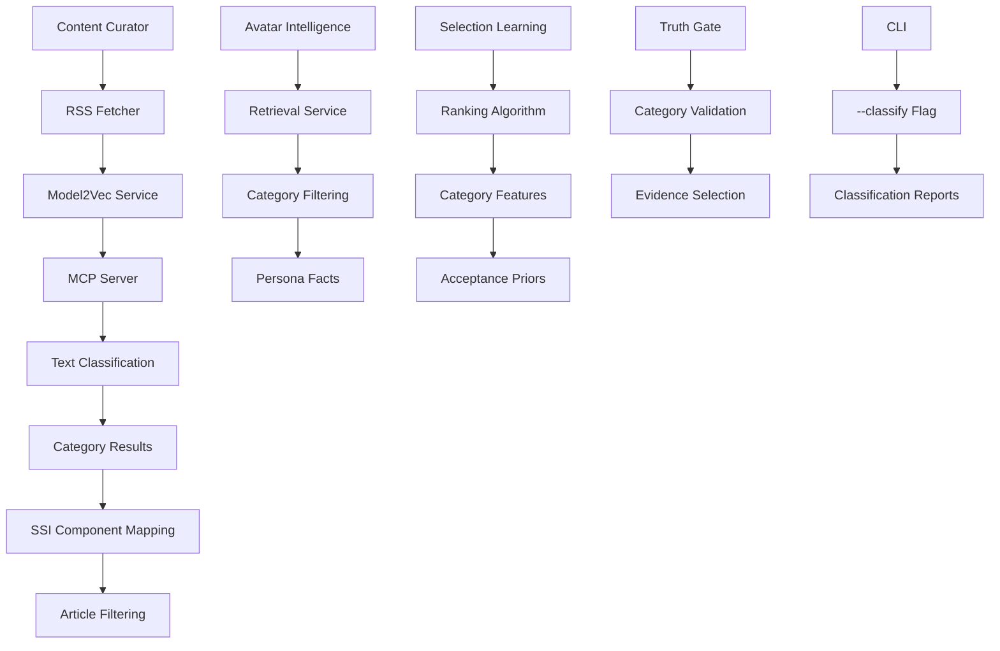

# Technical Design Document: Model2Vec NLP Enhancement for Knowledge Extraction and Classification

## Architecture Overview

The Model2Vec NLP enhancement integrates a Model Context Protocol (MCP) server for text classification into the LinkedIn SSI Booster's existing architecture. The enhancement adds fast static embedding-based classification capabilities while maintaining compatibility with the current spaCy NLP pipeline and truth gate system.



## Project System Integration

The Model2Vec enhancement integrates with existing system components through service layer abstraction and configuration management. The design follows established patterns for MCP integration and maintains backward compatibility.

### Service Layer Integration

- **New Service**: `services/model2vec_service.py` provides MCP client wrapper
- **Configuration**: Model2Vec settings added to `.env` and `services/shared.py`
- **Error Handling**: Graceful fallback when MCP server unavailable
- **Transport Support**: stdio (default), HTTP/SSE, Streamable HTTP

### Data Flow Integration

- **Input**: Text content from RSS articles, generated posts, persona facts
- **Processing**: MCP server handles classification with static embeddings
- **Output**: Category predictions with confidence scores
- **Storage**: Category metadata cached in memory, results passed to downstream components

## Component Design

### Model2Vec Service (`services/model2vec_service.py`)

**Responsibilities:**

- MCP client initialization and connection management
- Text classification request orchestration
- Category management (add, list, remove)
- Error handling and fallback logic
- Configuration loading from environment

**Key Classes:**

```python
class Model2VecService:
    def __init__(self, config: dict) -> None:
        self.mcp_client = MCPClient(config)
        self.categories = self._load_categories()

    def classify_text(self, text: str, top_k: int = 3) -> ClassificationResult:
        # Single text classification with MCP server

    def batch_classify(self, texts: list[str], top_k: int = 1) -> list[ClassificationResult]:
        # Batch processing for efficiency

    def add_category(self, name: str, description: str) -> bool:
        # Add custom category with embedding generation

    def list_categories(self) -> dict[str, str]:
        # Return category metadata
```

**Configuration Structure:**

```python
MODEL2VEC_CONFIG = {
    "mcp_server_command": "uv run text_classifier_server.py",
    "transport": "stdio",  # stdio, http+sse, streamable-http
    "model_name": "minishlab/potion-base-8M",
    "default_categories": [...],  # 10 predefined categories
    "confidence_threshold": 0.7,
    "batch_size": 50
}
```

### MCP Server Wrapper

**Transport Layer:**

- **Stdio**: Direct process communication for local development
- **HTTP/SSE**: Server-sent events for remote access
- **Streamable HTTP**: Enhanced HTTP transport for high-throughput scenarios

**Connection Management:**

- Automatic MCP server startup on first use
- Connection pooling for batch operations
- Health checks and reconnection logic
- Timeout handling (30s default)

## Data Model

### Classification Result Structure

```python
@dataclass
class ClassificationResult:
    text_hash: str  # For caching and deduplication
    predictions: list[CategoryPrediction]
    processing_time_ms: float
    confidence_threshold: float

@dataclass
class CategoryPrediction:
    category: str
    confidence: float
    description: str
    ssi_component: str  # Mapped SSI component
```

### Category Metadata

```python
@dataclass
class Category:
    name: str
    description: str
    embedding: Optional[np.ndarray]  # Cached for performance
    ssi_mapping: str  # establish_brand, find_right_people, etc.
    custom: bool  # True for user-added categories
```

### Integration Data Structures

```python
# Extended CandidateRecord for selection learning
@dataclass
class EnhancedCandidateRecord(CandidateRecord):
    categories: list[CategoryPrediction]
    primary_category: str
    category_confidence: float

# Extended PublishedRecord for learning tracking
@dataclass
class EnhancedPublishedRecord(PublishedRecord):
    category_performance: dict[str, float]
    ssi_component_alignment: str
```

## API Design

### MCP Tools Interface

**Classification Tools:**

- `classify_text(text: str, top_k: int = 3) -> ClassificationResult`
  - Single text classification with confidence scores
  - Returns top-k categories with descriptions

- `batch_classify(texts: list[str], top_k: int = 1) -> list[ClassificationResult]`
  - Efficient batch processing for multiple texts
  - Optimized for RSS article curation workflows

**Category Management Tools:**

- `add_custom_category(name: str, description: str) -> bool`
  - Add single custom category with embedding generation
  - Validates category name uniqueness

- `batch_add_custom_categories(categories: list[dict]) -> list[bool]`
  - Bulk category addition for setup efficiency
  - Input: `[{'name': str, 'description': str}]`

- `list_categories() -> dict[str, dict]`
  - Return all categories with metadata
  - Includes descriptions, SSI mappings, custom flags

- `remove_categories(names: list[str]) -> list[bool]`
  - Remove unwanted categories
  - Prevents removal of default categories

### MCP Resources

**categories://list**

- URI: `categories://list`
- Returns: JSON array of category objects
- MIME Type: `application/json`
- Purpose: Programmatic category access for integrations

**model://info**

- URI: `model://info`
- Returns: Model metadata and system status
- MIME Type: `application/json`
- Purpose: Health checks and capability discovery

### MCP Prompts

**classification_prompt**

- Template for text classification tasks
- Parameters: `text: str` to classify
- Returns: Formatted prompt with category context
- Purpose: Standardized classification workflows

## Integration Points

### Content Curator Integration

**File: `services/content_curator/_rss_fetcher.py`**

```python
def fetch_relevant_articles(self, feed_urls: list[str]) -> list[Article]:
    articles = self._fetch_articles(feed_urls)
    if self.classification_enabled:
        classified_articles = self.model2vec_service.batch_classify(
            [article.text for article in articles]
        )
        for article, classification in zip(articles, classified_articles):
            article.categories = classification.predictions
            article.primary_category = classification.predictions[0].category
    return articles
```

**File: `services/content_curator/_ssi_picker.py`**

```python
def select_by_ssi_component(self, articles: list[Article]) -> dict[str, list[Article]]:
    categorized = {}
    for article in articles:
        ssi_component = self._map_category_to_ssi(article.primary_category)
        categorized.setdefault(ssi_component, []).append(article)
    return self._balance_components(categorized)
```

### Avatar Intelligence Integration

**File: `services/avatar_intelligence/_retrieval.py`**

```python
def retrieve_relevant_facts(self, query: str, category_context: str = None) -> list[Fact]:
    candidates = self._bm25_retrieve(query)
    if category_context:
        candidates = self._filter_by_category(candidates, category_context)
    return self._rerank_by_relevance(candidates, query)
```

### Selection Learning Integration

**File: `services/selection_learning/_ranking.py`**

```python
def calculate_relevance_score(self, candidate: EnhancedCandidateRecord) -> float:
    base_score = self._compute_base_relevance(candidate)
    category_boost = self._compute_category_boost(candidate.primary_category)
    freshness_factor = self._compute_freshness_factor(candidate.published_date)
    prior_weight = self._get_acceptance_prior(candidate.source, candidate.primary_category)

    return base_score * category_boost * freshness_factor * prior_weight
```

### CLI Integration

**File: `main.py`**

```python
def parse_arguments():
    parser.add_argument('--classify', action='store_true',
                       help='Enable text classification during curation')
    parser.add_argument('--classification-threshold', type=float, default=0.7,
                       help='Minimum confidence threshold for category filtering')
```

## Security Considerations

### Local Execution Model

- MCP server runs locally with no external network dependencies
- Model downloads from trusted Hugging Face repository
- No sensitive data transmitted during classification operations
- Configuration follows existing dotenv security patterns

### Access Control

- Category management restricted to local process access
- No remote API endpoints exposed by default
- HTTP transports require explicit configuration
- Model files stored in user-controlled directories

### Data Protection

- Text content processed locally without external logging
- Category embeddings cached in memory only
- No persistent storage of classified text content
- Classification results used for processing but not stored long-term

## Performance Considerations

### Inference Optimization

- Static embeddings provide consistent <100ms inference time
- Batch processing with configurable batch sizes (default: 50)
- Connection pooling for MCP server communication
- Memory-efficient category embedding caching

### Resource Management

- Model loading: <30 seconds initial load, <50MB memory footprint
- Lazy initialization: MCP server starts on first classification request
- Connection timeouts: 30-second default with configurable overrides
- Background processing: Non-blocking classification for curation pipeline

### Scalability Design

- Horizontal scaling through MCP server instances
- Batch processing optimization for RSS article volumes
- Memory-efficient data structures for large article sets
- Configurable confidence thresholds for processing trade-offs

## Error Handling

### Classification Failures

- **MCP Server Unavailable**: Graceful fallback to category-agnostic processing
- **Low Confidence Scores**: Configurable threshold filtering with logging
- **Model Loading Errors**: Clear error messages with troubleshooting guidance
- **Network Timeouts**: Retry logic with exponential backoff

### Integration Error Handling

- **Service Unavailable**: Continue pipeline execution without classification
- **Invalid Category Data**: Validation with fallback to default categories
- **Configuration Errors**: Fail-fast with informative error messages
- **Batch Processing Errors**: Partial success handling with error reporting

### Monitoring and Alerting

- Classification success rate tracking (>95% target)
- Performance metrics logging (inference time, memory usage)
- Error rate monitoring with alerting thresholds
- MCP server health checks with automatic restart logic

### Recovery Strategies

- Automatic MCP server restart on connection failures
- Fallback to cached category mappings when service unavailable
- Partial result handling for batch classification failures
- Configuration validation with helpful error messages
