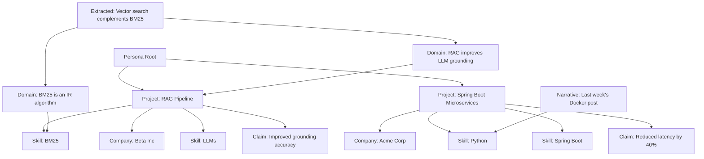
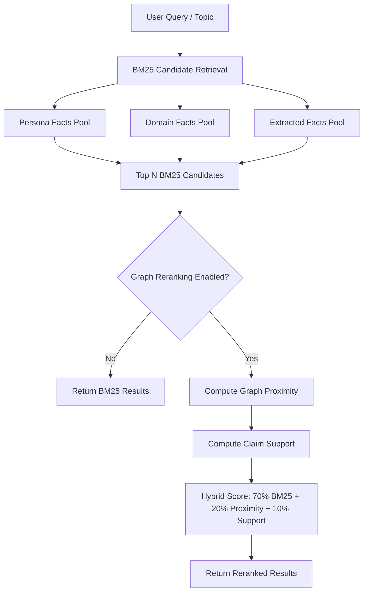

# Knowledge Graph Architecture

This document explains the NetworkX-powered knowledge graph, hybrid retrieval architecture, and why NetworkX is used instead of Neo4j.

---

## Overview

The LinkedIn SSI Booster uses an in-memory knowledge graph built with **NetworkX** to link persona facts, domain knowledge, extracted knowledge, and narrative memory into a unified retrieval system.

**Key Features:**

- **In-memory graph** — Fast, local-first, no external dependencies
- **Hybrid BM25+graph retrieval** — Combines keyword matching with graph proximity
- **Continual learning** — Graph expands as new knowledge is extracted from articles
- **Explaiability** — Trace fact relationships and grounding paths
- **NetworkX core, Neo4j for future expansion** — Simple now, scalable later

---

## Why NetworkX?

### Design Philosophy: Tight, Local Core

The core knowledge graph is implemented with **NetworkX**, an in-memory Python graph library. This choice is intentional:

| Aspect                    | NetworkX (Current)                               | Neo4j (Future Option)                         |
| ------------------------- | ------------------------------------------------ | --------------------------------------------- |
| **Storage**               | In-memory (RAM only)                             | On-disk, persistent                           |
| **Scale**                 | Best for small/medium graphs (<100k nodes/edges) | Scales to millions/billions of nodes/edges    |
| **Query Language**        | Python API, no query language                    | Cypher query language                         |
| **Performance**           | Fast for small graphs, slows with size           | Optimized for large, complex queries          |
| **Persistence**           | No built-in persistence                          | Full persistence, ACID compliance             |
| **Integration**           | Simple, pure Python                              | Requires running Neo4j server, extra setup    |
| **Learning/Dev Overhead** | Minimal, easy to use                             | Higher, requires Cypher and DB management     |
| **Use Case Fit**          | Prototyping, research, local automation          | Production, multi-user, large-scale analytics |
| **Cost**                  | Free, no infra                                   | Free (Community), but infra/ops required      |

**Bottom line:** The core of the avatar remains in NetworkX for speed, simplicity, and local-first operation. Neo4j is available for future expansion, mass knowledge injection, or advanced analytics if needed.

### Practical Capacity

There is no hard-coded node limit in the code; growth is bounded only by process RAM and the
practical NetworkX/Neo4j crossover noted in the table above (~100k nodes/edges before NetworkX
starts to strain and Neo4j becomes worth considering).

**Scalability Policy:**

- **NetworkX core** — For single-avatar, local-first operation (current use case)
- **Neo4j expansion** — If graph ever needs to scale to millions of nodes/edges (e.g., mass knowledge injection, multi-avatar, enterprise use)

---

## Graph Structure

### Node Types

| Node Type        | Description           | Example                                        |
| ---------------- | --------------------- | ---------------------------------------------- |
| `persona`        | Root persona node     | `persona_root`                                 |
| `project`        | Career project        | `project_42: Spring Boot microservices`        |
| `company`        | Employer              | `company_5: Acme Corp`                         |
| `skill`          | Technical skill       | `skill_17: Python`                             |
| `claim`          | Outcome/achievement   | `claim_9: Reduced latency by 40%`              |
| `domain_fact`    | Domain knowledge      | `domain_123: BM25 is an IR algorithm`          |
| `extracted_fact` | Learned from articles | `extracted_456: RAG improves LLM grounding`    |
| `narrative`      | Recent theme/claim    | `narrative_789: Last week's post about Docker` |

### Edge Types

| Edge Type      | Description                   | Example                       |
| -------------- | ----------------------------- | ----------------------------- |
| `has_project`  | Persona → Project             | persona_root → project_42     |
| `worked_at`    | Project → Company             | project_42 → company_5        |
| `uses_skill`   | Project → Skill               | project_42 → skill_17         |
| `achieved`     | Project → Claim               | project_42 → claim_9          |
| `supports`     | Fact → Fact (cross-reference) | domain_123 → extracted_456    |
| `mentioned_in` | Fact → Narrative              | extracted_456 → narrative_789 |
| `related_to`   | Domain fact → Domain fact     | domain_123 → domain_124       |

### Graph Diagram



---

## Hybrid Retrieval Architecture

The system combines **BM25 lexical retrieval** with **knowledge graph proximity reranking** for optimal fact selection.

### Retrieval Flow



### Hybrid Scoring Formula

$$
\text{final score} = 0.7 \times \text{BM25} + 0.2 \times \text{graph proximity} + 0.1 \times \text{claim support}
$$

**Components:**

1. **BM25 (70%)** — Traditional keyword matching for query relevance
2. **Graph Proximity (20%)** — Facts closer to persona node rank higher (shortest path distance)
3. **Claim Support (10%)** — Facts with more supporting edges (cross-references) rank higher

### Graph Proximity Calculation

**Shortest path distance from persona root:**

- Distance 1 (direct connection): Score = 1.0
- Distance 2 (one hop away): Score = 0.5
- Distance 3 (two hops away): Score = 0.25
- Distance 4+: Score = 0.1

### Claim Support Calculation

**Number of supporting edges:**

- 5+ supporting edges: Score = 1.0
- 3-4 supporting edges: Score = 0.7
- 1-2 supporting edges: Score = 0.4
- 0 supporting edges: Score = 0.0

---

## Graph Construction

### From Persona Graph

When `persona_graph.json` is loaded, the system constructs a persona subgraph:

```python
# Pseudo-code
persona_root = graph.add_node("persona_root", type="persona")

for project in persona_graph["projects"]:
    project_node = graph.add_node(f"project_{id}", type="project", **project)
    graph.add_edge(persona_root, project_node, type="has_project")

    for skill in project["skills"]:
        skill_node = graph.add_node(f"skill_{id}", type="skill", name=skill)
        graph.add_edge(project_node, skill_node, type="uses_skill")

    for claim in project["claims"]:
        claim_node = graph.add_node(f"claim_{id}", type="claim", text=claim)
        graph.add_edge(project_node, claim_node, type="achieved")
```

### From Domain Knowledge

When `domain_knowledge.json` (and `domain_knowledge_*.json` packs) are loaded:

```python
# Pseudo-code
for fact in domain_knowledge["facts"]:
    fact_node = graph.add_node(f"domain_{id}", type="domain_fact", **fact)

    # Link to related persona nodes (skills, projects)
    for skill in fact["tags"]:
        if skill_node exists:
            graph.add_edge(fact_node, skill_node, type="related_to")
```

### From Extracted Knowledge (Continual Learning)

When `--learn` extracts new facts from articles:

```python
# Pseudo-code
for fact in extracted_knowledge:
    fact_node = graph.add_node(f"extracted_{id}", type="extracted_fact", **fact)

    # Link to supporting domain facts (cross-references)
    for domain_fact in related_domain_facts:
        graph.add_edge(fact_node, domain_fact, type="supports")

    # Link to narrative memory (what prompted this learning)
    if narrative exists:
        graph.add_edge(fact_node, narrative, type="mentioned_in")
```

---

## Graph Operations

### Query: Find Facts Near Persona Node

**Use case:** Console mode query about "Python projects"

```python
# Pseudo-code
# 1. BM25 retrieval
candidates = bm25_retrieve("Python projects", persona_facts + domain_facts)

# 2. Graph reranking
for candidate in candidates:
    distance = shortest_path_length(persona_root, candidate.node)
    proximity_score = 1.0 / (2 ** (distance - 1))  # Exponential decay

    support_edges = len([e for e in graph.edges(candidate.node) if e.type == "supports"])
    support_score = min(1.0, support_edges / 5.0)

    hybrid_score = 0.7 * candidate.bm25 + 0.2 * proximity_score + 0.1 * support_score
    candidate.final_score = hybrid_score

# 3. Return top N
return sorted(candidates, key=lambda x: x.final_score, reverse=True)[:N]
```

### Query: Trace Grounding Path

**Use case:** `--avatar-explain` flag showing evidence IDs

```python
# Pseudo-code
for fact_id in evidence_ids:
    node = graph.node(fact_id)
    path = shortest_path(persona_root, node)

    print(f"Grounding path: {' → '.join([n.label for n in path])}")
    # Output: "Persona Root → Project: RAG Pipeline → Skill: BM25 → Domain: BM25 is an IR algorithm"
```

### Query: Find Supporting Facts

**Use case:** Truth gate validation — check if claim has supporting evidence

```python
# Pseudo-code
claim_node = graph.node(claim_id)
supporting_facts = [
    n for n in graph.neighbors(claim_node)
    if graph.edge(claim_node, n).type == "supports"
]

if len(supporting_facts) == 0:
    flag_as("weak_claim_support")
```

---

## Graph Statistics (Console Command)

Use `/graph-stats` in console mode to inspect graph structure:

```bash
python main.py --console
Sam> /graph-stats
```

**Output:**

```
Knowledge Graph Statistics:
- Total nodes: 847
- Total edges: 1,523

Node types:
- persona: 1
- project: 42
- company: 12
- skill: 87
- claim: 156
- domain_fact: 234
- extracted_fact: 289
- narrative: 26

Edge types:
- has_project: 42
- worked_at: 42
- uses_skill: 312
- achieved: 156
- supports: 567
- mentioned_in: 289
- related_to: 115

Average node degree: 1.80
Graph density: 0.0021
Connected components: 1
```

---

## Graph Persistence

### Current: No Built-In Persistence

NetworkX graphs are **in-memory only** and reconstructed on every application start from JSON files:

- `persona_graph.json`
- `domain_knowledge.json` (+ `domain_knowledge_*.json` packs)
- `extracted_knowledge.json`
- `narrative_memory.json`

**Startup time:** negligible at current scale; still sub-second well past 10,000 nodes

### Future: Neo4j Persistence (Optional)

If graph grows beyond 100k nodes/edges, Neo4j can be used for persistent storage:

```python
# Pseudo-code migration path
from neo4j import GraphDatabase

driver = GraphDatabase.driver("bolt://localhost:7687", auth=("neo4j", "password"))

with driver.session() as session:
    # Export NetworkX graph to Neo4j
    for node, data in nx_graph.nodes(data=True):
        session.run(
            "CREATE (n:{label} {properties})",
            label=data["type"],
            properties={k: v for k, v in data.items() if k != "type"}
        )

    for u, v, data in nx_graph.edges(data=True):
        session.run(
            "MATCH (a), (b) WHERE id(a) = {u} AND id(b) = {v} CREATE (a)-[:{type}]->(b)",
            u=u, v=v, type=data["type"]
        )
```

**Benefits:**

- Persistent, ACID-compliant storage
- Cypher query language for complex graph traversals
- Scales to millions of nodes/edges

**Trade-offs:**

- Requires running Neo4j server
- Higher learning curve (Cypher)
- More infrastructure overhead

---

## Integration with Main Application

### Schedule Mode

1. Topic loaded from `content_calendar.py`
2. BM25 retrieves relevant persona + domain facts
3. Graph reranking (if enabled) prioritizes facts close to persona node
4. Top N facts injected into LLM prompt
5. Generated post validated by truth gate
6. Grounding path logged for `--avatar-explain`

### Curate Mode

1. Article fetched from RSS feed
2. BM25 retrieves relevant persona + domain + extracted facts
3. Graph reranking prioritizes facts with high claim support
4. Top N facts injected into LLM prompt
5. Generated commentary validated by truth gate
6. If `--learn` enabled, new facts extracted and added to graph

### Console Mode

1. User query entered
2. Query routing determines retrieval mode (deterministic, learned, or hybrid)
3. BM25 retrieves relevant facts
4. **Graph reranking always enabled** — prioritizes facts close to persona node
5. Top N facts returned or injected into LLM prompt
6. `/graph-stats` shows graph structure

---

## Graph Visualization (Future)

Future enhancement: Generate interactive graph visualization using NetworkX + D3.js:

```bash
python main.py --visualize-graph --output graph.html
```

**Features:**

- Color-coded node types (persona, project, skill, claim, domain, extracted)
- Edge labels (has_project, uses_skill, supports, etc.)
- Interactive zoom, pan, and node selection
- Click node to see details (fact text, evidence IDs, grounding path)

---

## See Also

- [Learning Pipeline](learning-pipeline.md) — How graph facts are used in truth gate and confidence scoring
- [Persona and Avatar Intelligence](persona-and-avatar.md) — Persona design and grounding
- [Usage Guide](usage-schedule-curate-console.md) — Console `/graph-stats` command
- [CLI Reference](cli-reference.md) — All CLI flags and options
