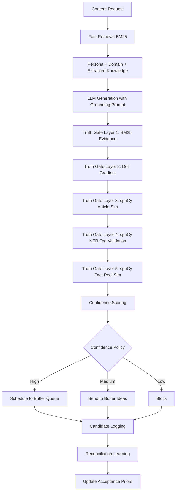

# Learning, Grounding, and Explainability Pipeline

This document explains how the LinkedIn SSI Booster learns, grounds content in facts, and provides transparency into its decision-making process.

---

## Overview

The system implements a multi-stage pipeline that ensures every generated post is:

1. **Grounded** — Based on real facts from your persona, domain knowledge, and learned articles
2. **Validated** — Passed through a 5-layer truth gate to remove unsupported claims
3. **Scored** — Assigned confidence scores for routing (Ideas vs direct posting)
4. **Learned from** — Tracked and reconciled to improve future content selection

---

## Pipeline Stages



---

## Stage 1: Fact Retrieval

### BM25 Candidate Selection

Before generation, the system retrieves relevant facts using **BM25Okapi** (production-grade IR algorithm).

**Retrieval pools:**

1. **Persona graph** — Projects, companies, skills, claims from `persona_graph.json`
2. **Domain knowledge** — Technical facts from `domain_knowledge.json` and `domain_knowledge_*.json` packs
3. **Extracted knowledge** — Learned facts from `extracted_knowledge.json` (via `--learn`)
4. **Narrative memory** — Recent themes and claims from `narrative_memory.json`

**Key features:**

- Rare, high-signal skills and projects are prioritized
- Facts are ranked by relevance to the query/topic
- Top N facts (configurable via `EXTRACTED_CONTEXT_LIMIT`) are injected into prompts

### Hybrid Graph Reranking (Console Mode)

In console mode, retrieved facts are reranked using knowledge graph proximity:

$$
\text{final score} = 0.7 \times \text{BM25} + 0.2 \times \text{graph proximity} + 0.1 \times \text{claim support}
$$

- **Graph proximity** — Facts closer to the persona node rank higher
- **Claim support** — Facts with more supporting edges (cross-references) rank higher

---

## Stage 2: Grounded Generation

### Prompt Construction

The system constructs prompts with strict grounding requirements:

```
You are [persona description].

GROUNDING RULES:
- Every factual claim must be grounded in either the article or your persona facts
- Personal references are capped at [N] per post
- Invented stats/dates/companies are forbidden
- Use the provided evidence: [retrieved facts]

ARTICLE: [source article text]

PERSONA FACTS: [top N persona facts]
DOMAIN FACTS: [top N domain facts]
EXTRACTED FACTS: [top N extracted facts]

Generate a LinkedIn post about [topic]...
```

**Prompt balance rules:**

- Facts must be supported by evidence (article or persona)
- Personal references are limited to avoid over-indexing on "I"
- Numbers, dates, and company names must appear in source evidence

### LLM Generation

Primary model: `gemma4:e4b` (fallback: `qwen3.5:9b`)

- Context window: 32K tokens (configurable via `OLLAMA_NUM_CTX`)
- Temperature: Low for factual content, moderate for creative
- Max retries: 1 (fallback model)

---

## Stage 3: Truth Gate (5 Layers)

Every generated sentence passes through five sequential validation layers. Sentences that fail any layer are flagged with a reason code and removed.

### Layer 1: BM25 Evidence Scoring

**Purpose:** Ensure sentence is supported by source evidence (article + persona facts)

**How it works:**

1. Sentence is scored against article text and persona facts using BM25
2. Score below `TRUTH_GATE_BM25_THRESHOLD` (default: 1.0) → flagged as `weak_evidence_bm25`
3. Sentence is removed

**Configuration:**

```bash
TRUTH_GATE_BM25_THRESHOLD=1.0  # 0.5 = permissive, 2.0 = strict
```

### Layer 2: Derivative of Truth (DoT) Gradient

**Purpose:** Catch sentences that pass BM25 but have weak reasoning or low credibility

**How it works:**

1. Composite truth gradient calculated using 4-term formula:

   $$
   \text{DoT} = 0.25 \times \text{evidence type} + 0.25 \times \text{reasoning quality} + 0.25 \times \text{source credibility} + 0.25 \times \text{token overlap}
   $$

2. Score below `TRUTH_GRADIENT_FLAG_THRESHOLD` (default: 0.35) → flagged as `weak_dot_gradient`
3. Sentence is removed

**Configuration:**

```bash
TRUTH_GRADIENT_FLAG_THRESHOLD=0.35  # 0.25 = permissive, 0.50 = strict
```

**Evidence type scoring:**

- Primary source (peer-reviewed, official docs): 1.0
- Secondary source (news, blogs): 0.7
- Tertiary source (social media, forums): 0.4
- No source: 0.0

**Reasoning quality:**

- Deductive (fact → conclusion): 1.0
- Inductive (pattern → generalization): 0.7
- Abductive (best explanation): 0.5
- Assertion (no reasoning): 0.0

**Token overlap:**

- Jaccard similarity between sentence and evidence facts
- Weights: 0.25 (25% of total score)

See [Derivative of Truth](derivative-of-truth.md) for full mathematical framework.

### Layer 3: spaCy Article Similarity Floor

**Purpose:** Catch paraphrased hallucinations for specific-claim sentences (numbers, dates, orgs, years)

**How it works:**

1. Check if sentence contains numeric claim, year, dollar amount, or org name
2. If yes, compute spaCy cosine similarity between sentence and source article
3. Similarity below `TRUTH_GATE_SPACY_SIM_FLOOR` (default: 0.10) → flagged as `low_semantic_similarity`
4. Sentence is removed

**Configuration:**

```bash
TRUTH_GATE_SPACY_SIM_FLOOR=0.10  # 0.05 = permissive, 0.20 = strict
```

**Note:** This layer only runs in **curation mode** where source articles are available.

### Layer 4: spaCy NER Org-Name Validation

**Purpose:** Verify org/company names are present in allowed evidence set

**How it works:**

1. Extract org/company names using spaCy Named Entity Recognition (`ORG` entities)
2. Check if org name appears in article text or persona facts
3. If not found → flagged as `unsupported_org`
4. Sentence is removed

**False-positive hardening:**

Tech terms and version strings are filtered before ORG enforcement:

- Concept/service tokens: `S3`, `AI Q&A`, `Cloud Functions`
- Tech-version entities: `Java 21`, `Python 3.11`, `Node.js 18`

**Fallback:** Legacy regex when spaCy is unavailable

### Layer 5: spaCy Fact-Pool Similarity Floor

**Purpose:** Ensure sentence has semantic overlap with persona/domain facts (universal check)

**How it works:**

1. Compute spaCy cosine similarity between sentence and every persona/domain fact
2. Take best match (highest similarity)
3. Best match below `TRUTH_GATE_FACT_SIM_FLOOR` (default: 0.05) → flagged as `low_fact_similarity`
4. Sentence is removed

**Configuration:**

```bash
TRUTH_GATE_FACT_SIM_FLOOR=0.05  # 0.03 = permissive, 0.15 = strict
```

**Note:** This layer runs in **all modes** (including console) because persona/domain facts are always present.

---

## Stage 4: Confidence Scoring

After truth gate, the system assigns a confidence score to each post based on:

### Grounding Score (0-1)

- **Metrics:**
  - BM25 evidence strength
  - DoT gradient
  - spaCy similarity scores
  - Truth gate pass rate (% of sentences retained)

- **Calculation:**
  $$
  \text{grounding} = 0.4 \times \text{BM25 avg} + 0.3 \times \text{DoT avg} + 0.2 \times \text{pass rate} + 0.1 \times \text{spaCy avg}
  $$

### Novelty Score (0-1)

- **Metrics:**
  - Semantic distance from recent posts (spaCy similarity)
  - Theme diversity (not repeating same angles)

- **Calculation:**
  $$
  \text{novelty} = 1 - \max(\text{similarity to recent posts})
  $$

### Repetition Penalty (0-1)

- **Metrics:**
  - Jaccard similarity against narrative memory
  - Claim overlap with recent posts

- **Calculation:**
  $$
  \text{repetition} = 1 - \frac{\text{overlapping claims}}{\text{total claims}}
  $$

### Composite Confidence

$$
\text{confidence} = 0.5 \times \text{grounding} + 0.3 \times \text{novelty} + 0.2 \times \text{repetition}
$$

---

## Stage 5: Routing (Confidence Policy)

Based on the confidence score and selected policy, posts are routed to:

| Policy        | Threshold | Destination                                 |
| ------------- | --------- | ------------------------------------------- |
| `balanced`    | ≥ 0.70    | Schedule to Buffer queue                    |
| (default)     | 0.40-0.69 | Send to Buffer Ideas for manual review      |
|               | < 0.40    | Block (not sent to Buffer)                  |
| `strict`      | ≥ 0.80    | Schedule to Buffer queue                    |
|               | 0.50-0.79 | Send to Buffer Ideas                        |
|               | < 0.50    | Block                                       |
| `draft-first` | -         | Everything goes to Ideas, nothing scheduled |

**Configuration:**

```bash
AVATAR_CONFIDENCE_POLICY=balanced  # balanced, strict, draft-first
```

---

## Stage 6: Candidate Logging

Every generated post and curated article candidate is logged to `data/selection/generated_candidates.jsonl`.

**Logged fields:**

- `timestamp` — When candidate was generated
- `source` — RSS feed URL (for curation) or calendar topic (for schedule)
- `topic` — Content topic/theme
- `ssi_component` — Target SSI pillar
- `confidence` — Composite confidence score
- `truth_gate_removals` — Number of sentences removed and reason codes
- `routed_to` — `post`, `idea`, or `block`
- `buffer_post_id` — Buffer ID (if published)
- `selected` — `null` (pending), `true` (published), `false` (rejected)

---

## Stage 7: Reconciliation & Learning

Periodically (e.g., weekly), run `--reconcile` to match Buffer-published posts against candidate log:

```bash
python main.py --reconcile
```

**Matching logic:**

1. Exact Buffer post ID match
2. Article URL match
3. Jaccard token similarity (≥ 0.8)

**Learning updates:**

- Matched candidates → `selected=True`
- Older unmatched candidates → `selected=False`
- Beta-smoothed acceptance priors calculated per source, topic, SSI component

**Acceptance prior formula:**

$$
\text{prior} = \frac{\alpha + \text{accepted}}{\alpha + \beta + \text{total}}
$$

Where:

- $\alpha = 1$ (prior successes)
- $\beta = 1$ (prior failures)
- Smooths estimates for low-sample sources

**Future ranking:**

Articles from high-acceptance sources and topics float to the top of curation ranking.

---

## Explainability Features

### `--avatar-explain`

Show which facts grounded each post:

```bash
python main.py --schedule --week 1 --avatar-explain
```

**Output:**

```
Evidence IDs: persona_42, domain_17, extracted_9
Grounding Summary:
- 3 persona facts
- 2 domain facts
- 1 extracted fact
```

### `--dot-report`

Show Derivative of Truth breakdown:

```bash
python main.py --curate --dot-report
```

**Output:**

```
Truth Gradient: 0.82
Evidence Type: 0.90 (primary source)
Reasoning Quality: 0.85 (deductive)
Source Credibility: 0.75 (peer-reviewed)
Token Overlap: 0.78 (Jaccard = 0.78)
Uncertainty: 0.12
```

### `--avatar-learn-report`

Show learning statistics:

```bash
python main.py --avatar-learn-report
```

**Output:**

```
Acceptance Priors:
- TechCrunch: 0.72 (18/25 accepted)
- HackerNews: 0.58 (12/21 accepted)
- VentureBeat: 0.41 (7/17 accepted)

Truth Gate Statistics:
- weak_evidence_bm25: 142 sentences
- weak_dot_gradient: 89 sentences
- low_semantic_similarity: 34 sentences
- unsupported_org: 12 sentences
- low_fact_similarity: 8 sentences

Confidence Routing:
- Scheduled: 45 posts
- Ideas: 78 posts
- Blocked: 12 posts
```

---

## Noise Filtering (Continual Learning)

Before sentences are stored as extracted knowledge, a multi-layer quality filter rejects low-signal content:

| Filter                         | What it catches                                                                                                        |
| ------------------------------ | ---------------------------------------------------------------------------------------------------------------------- |
| First-person narration         | Author asides ("As I write this…", "I sat down with…")                                                                 |
| Truncated RSS fragments        | Sentences ending in "… Read more" or trailing ellipsis/dash                                                            |
| Newsletter/podcast preambles   | Openers like "Welcome to…", "For this episode…", "In last week's…"                                                     |
| Article boilerplate openers    | "In this post, we show…", "In this tutorial, we walk through…" — preamble, not knowledge                               |
| Disclaimer / AI-disclosure     | "This article was created using AI-based writing companions" and similar                                               |
| Pure or URL-heavy sentences    | Sentences that are just a URL, or where URLs make up >40% of the character length                                      |
| "We show / we introduce" leads | "we show how", "we walk you through", "we take a deeper look" — structural preamble openers                            |
| Weak-entity sentences          | All detected entities resolve to stopwords ("this gap", "the model", "the goal") with no numeric or proper-noun signal |
| Navigation / contributor blobs | Sentences ≥12 words where >45% of tokens start with uppercase (HuggingFace menus, author lists)                        |
| Zero-signal sentences          | Sentences with no digit, no 2+-char acronym, and no consecutive title-case words — pure filler                         |

These filters run **before** spaCy NLP and deduplication, so only genuinely informative domain sentences reach the knowledge graph.

---

## Memory & Narrative Learning

### Narrative Memory

Recent themes and claims are stored in `data/avatar/narrative_memory.json` (FIFO, max 200 items by default).

**Used for:**

- Repetition detection (penalize repeated angles)
- Topic diversity (avoid clustering on same theme)

**Configuration:**

```bash
AVATAR_MAX_MEMORY_ITEMS=200  # Max items before FIFO trim
AVATAR_LEARNING_ENABLED=true  # Enable narrative memory
```

### Moderation Events

Every truth gate removal, confidence decision, and routing outcome is logged as a **moderation event**.

**Logged fields:**

- `timestamp` — When event occurred
- `sentence` — Removed sentence text
- `reason_code` — `weak_evidence_bm25`, `weak_dot_gradient`, etc.
- `bm25_score` — BM25 evidence score
- `dot_score` — DoT gradient score
- `spacy_sim` — spaCy similarity score
- `routed_to` — Final routing destination

**Used for:**

- Learning report (`--avatar-learn-report`)
- Threshold tuning (adjust env vars based on removal stats)

---

## See Also

- [Derivative of Truth](derivative-of-truth.md) — Full DoT mathematical framework
- [Persona and Avatar Intelligence](persona-and-avatar.md) — Persona design and grounding
- [Environment Variables Reference](environment-variables.md) — All truth gate and learning thresholds
- [CLI Reference](cli-reference.md) — `--avatar-explain`, `--dot-report`, `--avatar-learn-report` flags
