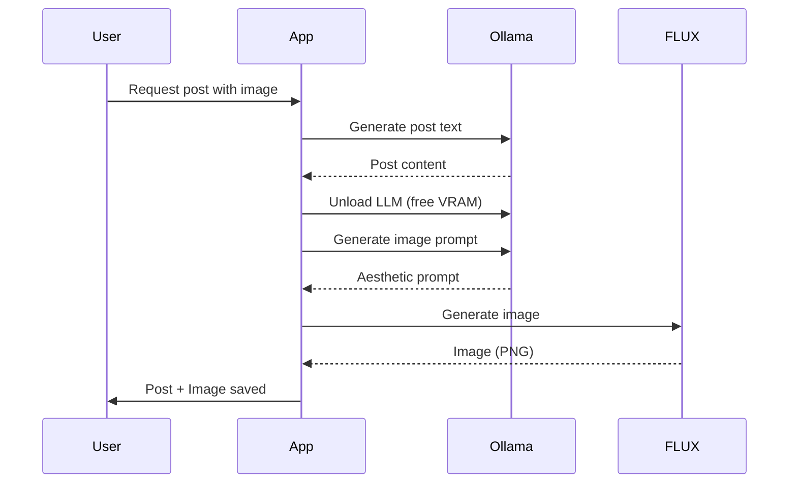
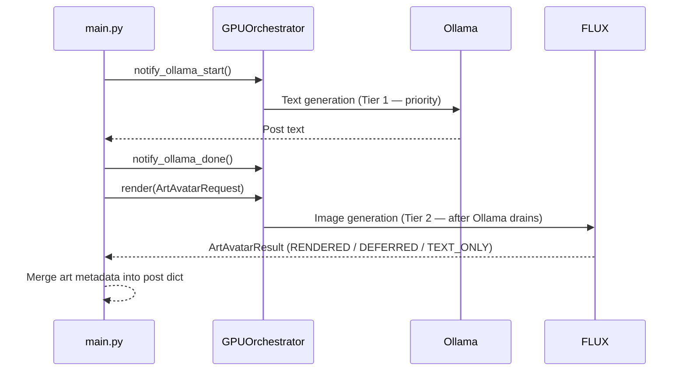
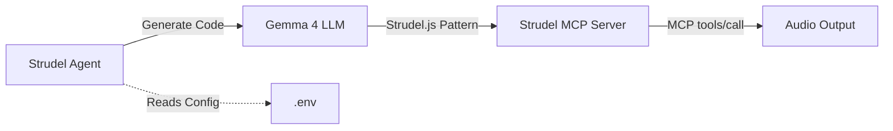
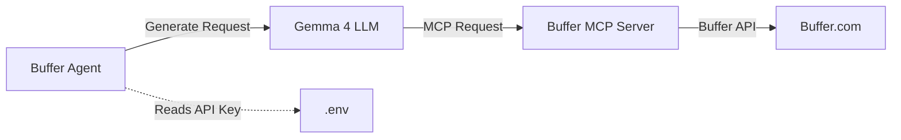

# Multimodal Features: FLUX Image Generation, Strudel Music, and Buffer MCP

This document covers the three multimodal extensions to the LinkedIn SSI Booster: FLUX.1-schnell image generation, Strudel live-coding music agent, and Buffer MCP agent.

---

## 🎨 FLUX.1-schnell Image Generation

### Overview

FLUX.1-schnell is a state-of-the-art image generation model running locally on your GPU. The system generates professional, persona-aligned visuals for LinkedIn posts without cloud costs or privacy concerns. In the README, this is presented as the Alex Grey Avatar Enhancement: a visual-branding layer built from the source text plus FLUX style controls.

**Key Features:**

- **Local execution** — No API keys, no cloud costs, full privacy
- **VRAM optimized** — Built for consumer hardware (tested on RTX 3060 12GB)
- **GGUF quantization** — 4-bit quantized model fits in local memory
- **Sequential execution** — Intelligent VRAM management (unloads LLM before image gen)
- **Aesthetic grounding** — Prompts generated by agent to match post theme

### Hardware Requirements

| Component  | Minimum      | Recommended             |
| ---------- | ------------ | ----------------------- |
| GPU        | RTX 3060 8GB | RTX 3060 12GB or better |
| VRAM       | 8GB          | 12GB+                   |
| Disk Space | 10GB free    | 20GB+ free              |
| CUDA       | 12.4.1+      | 12.4.1+                 |

**Note:** 8GB cards may struggle with full profile. Use `core` profile for daily operations and only enable `full` profile when you need post visuals.

### Setup

#### 1. Get Civitai API Key

Sign up at [Civitai](https://civitai.com/) and generate an API key. This is required to download the FLUX GGUF weights.

#### 2. Configure Environment

Add to `.env`:

```bash
CIVITAI_API_KEY=your_civitai_key_here
FLUX_MODEL_PATH=/app/models/flux
FLUX_DIFFUSERS_CONFIG_DIR=/app/models/flux/diffusers_config
GENERATED_CONTENT_DIR=/app/yt-vid-data
YOUTUBE_SCRIPTS_SUBDIR=youtube_scripts
REI_TOEI_SUBDIR=rei_toei
```

#### 3. Launch Full Profile

```bash
# Using run.sh (recommended)
bash run.sh --profile full up -d

# Or docker compose directly
docker compose --profile full up -d
```

### How It Works

#### First Start Sequence

1. **`flux-init`** (one-shot container) downloads model files to `./models/flux/`
2. Ensure local diffusers config exists at `./models/flux/diffusers_config/` (`model_index.json` and `transformer/config.json`)
3. **`flux_capacitor`** waits for `flux-init` to complete
4. **`flux_capacitor`** compiles `llama-cpp-python` with CUDA support (5-10 minutes)
5. **`flux_capacitor`** starts inference service
6. **`app`** can now generate images via FLUX API

> **Note:** `flux-init` exits after downloading weights. This is expected behavior.

#### Image Generation Flow



#### Art avatar prompt influence

The art avatar is not driven by a separate persona graph. It uses the source story or console reply as the main input, then layers on the active FLUX style preset, the optional `FLUX_CAPACITOR_STYLE_SYSTEM_PROMPT`, and any realism hint or short knowledge context supplied by the caller.

#### Key Fixes Applied

- **T5 Encoder Loading**: Fixed to use `from_pretrained` with `gguf_file` parameter instead of `from_single_file` to prevent "Cannot copy out of meta tensor" errors
- **VAE Configuration**: Added local VAE config to prevent fallback to SD1.5 default repo
- **CUDA Visibility**: Fixed `LD_LIBRARY_PATH` in Dockerfile to use real driver libcuda at runtime instead of stub
- **Cleanup**: Removed unused `model_index.json` from download script
- **Error Handling**: Added comprehensive error handling and logging throughout
- **GPU Sequencing**: Fixed CUDA visibility issues by ensuring runtime uses real libcuda

These fixes resolve the "Cannot copy out of meta tensor" error and enable GPU-accelerated FLUX image generation on RTX 3060 systems.

### Pre-Download Weights (Optional)

Download weights without starting the full stack:

```bash
docker compose --profile full run --rm flux-init
```

Or manually using the provided script:

```bash
bash scripts/download-flux1-schnell-Q4_K_S.sh
```

### Output

Generated artifacts are saved under the generated-content root:

- **Host:** `./yt-vid-data/` (bind-mounted)
- **Container:** `/app/yt-vid-data/`

Examples:
- YouTube scripts: `./yt-vid-data/youtube_scripts/`
- Rei Toei outputs: `./yt-vid-data/rei_toei/`

**Naming convention:** `flux_<timestamp>_<hash>.png`

### Troubleshooting

**Problem:** `flux-init` fails with "Unauthorized" error

**Solution:** Verify `CIVITAI_API_KEY` in `.env` is valid

**Problem:** `flux_capacitor` crashes with "Out of Memory"

**Solution:**

1. Close other GPU applications
2. Reduce `OLLAMA_NUM_CTX` in `.env` (e.g., from `32768` to `16384`)
3. Use `core` profile for daily operations

**Problem:** Image generation is slow

**Solution:** This is expected. FLUX.1-schnell takes 30-60 seconds per image on RTX 3060 12GB.

---

## � FLUX Capacitor Art Avatar

### Overview

The `services/flux_capacitor` package is an in-process art-avatar layer that runs on top of FLUX.1-schnell with a strict **Ollama-first GPU sequencing policy**. It is integrated into the three main CLI workflows and can be triggered interactively from the console.

**Key design rules:**
- Ollama text generation always runs first; FLUX only starts after Ollama drains.
- One GPU job at a time (`FLUX_CAPACITOR_MAX_CONCURRENT_GPU_JOBS=1`).
- Requests that exceed the wait threshold degrade gracefully to `text_only` — no hard failure.
- Story text (the narrative prompt given to FLUX) is persisted locally as a `.txt` sidecar alongside each image.
- **Disabled by default** — set `FLUX_CAPACITOR_ENABLED=true` to activate.

### Integration Points

| Flow | Where art fires | Skip conditions |
|---|---|---|
| `--schedule` | After Ollama post generation, per post | `channel == youtube` |
| `--curate` | After `curate_and_create_ideas()`, per returned idea | `channel == youtube` or `channel == all` |
| `--console` | `/art [topic]` command — renders from last AI reply | Empty history |

### GPU Sequencing



### Console `/art` Command

In `--console` mode, type `/art` (with optional topic hint) to render FLUX art from the last assistant reply:

```
You> write a LinkedIn post about async Rust
Sam> [reply...]

You> /art async Rust event loop
🎨 Requesting art avatar...
✅  Art rendered → yt-vid-data/flux_capacitor/20260625_143500_linkedin_a1b2c3d4_req-frag.png
   Story → yt-vid-data/flux_capacitor/stories/20260625_143500_linkedin_a1b2c3d4_req-frag.txt
```

If the GPU is busy the response is:

```
⏳  GPU busy — Ollama active, FLUX deferred (waited 120s)
```

The optional topic hint is used as the short knowledge/context input for the image prompt, so it can steer the composition without replacing the actual source reply.

### Output Artifacts

Generated files are saved under `GENERATED_CONTENT_DIR/FLUX_CAPACITOR_SUBDIR/`:

```
yt-vid-data/
  flux_capacitor/
    20260625_143000_linkedin_abc12345_req-frag.png         ← image
    20260625_143000_linkedin_abc12345_req-frag.json        ← image metadata sidecar
    stories/
      20260625_143000_linkedin_abc12345_req-frag.txt       ← story text
      20260625_143000_linkedin_abc12345_req-frag_meta.json ← story metadata sidecar
```

### Style Presets

Three presets are available via `FLUX_CAPACITOR_STYLE_PRESET`:

| Preset | Visual Character |
|---|---|
| `corporate_minimal` | Muted palette, shallow sacred-geometry hints, polished corporate-safe |
| `sacred_geometry_light` | Soft light accents, subtle geometry, still restrained |
| `tech_dark` | Dark background, cyan/purple accents, grid-inspired tech aesthetic |

All presets enforce hard clamps on saturation, geometry density, and surreal intensity. See [environment-variables.md](environment-variables.md#flux-capacitor-art-avatar) for tuning knobs.

### Enabling in `.env`

```bash
# Enable art-avatar generation
FLUX_CAPACITOR_ENABLED=true

# Requires --profile full (FLUX model must be available)
# bash run.sh --profile full up -d
```

> **Note:** `FLUX_CAPACITOR_ENABLED=true` without `--profile full` will log a warning and return `text_only` results — no crash.

---

## �🎵 Strudel Live-Coding Music Agent

### Overview

> **Inspiration:** [Switch Angel](https://www.youtube.com/@Switch-Angel) | [Github: strudel-scripts](https://github.com/switchangel/strudel-scripts) | [Do I have your Attention???](https://youtube.com/shorts/sjsS60OTXSQ?si=s4lk7A1hsDyc5cTM)

Strudel is a live-coding music language for generating algorithmic patterns. The SSI Booster includes an autonomous agent that uses Gemma 4 to generate Strudel.js code and sends it to a local MCP server over stdio JSON-RPC for real-time audio playback.

**Key Features:**

- **Autonomous agent service** — Runs as standalone Docker service
- **Live-coding generation** — Gemma 4 generates clean, executable Strudel.js code
- **MCP stdio execution** — JSON-RPC tool calls for real-time evaluation and audio playback
- **Container-native** — All components in Docker with auto-dependency management
- **Future enhancement** — Persona-aligned music tied to LinkedIn post themes/sentiment

### Architecture



### Setup

#### 1. Configure Environment

Strudel agent is enabled by default in `core` and `full` profiles. No additional configuration required.

**Optional overrides** (in `.env`):

```bash
# Ollama server URL (auto-set in Docker)
OLLAMA_HOST=http://ollama:11434

# Strudel MCP command (stdio transport)
STRUDEL_MCP_COMMAND=npx -y @williamzujkowski/live-coding-music-mcp
```

#### 2. Launch Stack

```bash
bash run.sh --profile core up -d
```

### Usage

#### Monitor Agent Activity

```bash
docker compose logs -f strudel-mcp-agent
```

#### Run Agent with Custom Prompt (One-Off)

```bash
docker compose --profile core run --rm strudel-mcp-agent python agents/strudel_mcp_agent.py
```

#### Edit Agent Code

Agent code is bind-mounted from `./agents/` — edit and restart:

```bash
nano agents/strudel_mcp_agent.py
docker compose restart strudel-mcp-agent
```

### How It Works

1. **Agent** prompts Gemma 4 with system prompt optimized for Strudel.js syntax
2. **Gemma 4** generates clean Strudel code (no markdown, no extra text)
3. **Agent** sends code to Strudel MCP server via MCP tools/call over stdio
4. **Strudel MCP** evaluates pattern and outputs audio in real-time

### Example Strudel Pattern

```javascript
// Generated by Gemma 4
note("c3 eb3 g3").sound("sawtooth").room(0.5).delay(0.3);
```

### Troubleshooting

**Problem:** Strudel MCP health check fails

**Solution:** Check logs:

```bash
docker compose logs strudel-mcp-agent
docker compose --profile core run --rm strudel-mcp-agent python agents/strudel_mcp_agent.py --health-check
```

Verify `STRUDEL_MCP_COMMAND` is valid and the MCP server can return required tools (`init`, `edit_pattern`, `playback`).

**Problem:** Agent generating invalid code

**Solution:** Gemma 4 system prompt is optimized for Strudel syntax. If issues persist, edit `agents/strudel_mcp_agent.py` to refine the prompt.

**Problem:** No audio output

**Solution:** Run health check mode and confirm MCP tool calls pass before running generation:

```bash
docker compose --profile core run --rm strudel-mcp-agent python agents/strudel_mcp_agent.py --health-check
```

---

## 📤 Buffer MCP Agent

### Overview

The Buffer MCP agent provides natural language access to the Buffer API. Uses Gemma 4 to translate plain English commands into properly formatted Buffer MCP requests.

**Key Features:**

- **Autonomous agent service** — Runs as standalone Docker service
- **Natural language interface** — Plain English commands → Buffer API calls
- **Direct MCP integration** — Connects to Buffer's official MCP server at `https://mcp.buffer.com/mcp`
- **Full Buffer API access** — List channels, create posts, manage drafts, schedule content
- **Container-native** — Runs alongside Ollama in Docker with auto-authentication
- **Future enhancement** — Voice-controlled Buffer operations, auto post-performance analytics

### Architecture



### Setup

#### 1. Get Buffer API Key

Sign up at [Buffer](https://buffer.com/) and generate an API key from your [Developer Dashboard](https://buffer.com/developers/api).

#### 2. Configure Environment

Add to `.env`:

```bash
BUFFER_API_KEY=your_buffer_api_key_here
```

#### 3. Launch Stack

```bash
bash run.sh --profile core up -d
```

### Usage

#### Monitor Agent Activity

```bash
docker compose logs -f buffer-mcp-agent
```

#### Run Agent with Custom Prompt (One-Off)

```bash
docker compose --profile core run --rm buffer-mcp-agent python agents/buffer_mcp_agent.py
```

#### Edit Agent Code

Agent code is bind-mounted from `./agents/` — edit and restart:

```bash
nano agents/buffer_mcp_agent.py
docker compose restart buffer-mcp-agent
```

### How It Works

1. **Agent** prompts Gemma 4 with natural language command (e.g., "list my channels")
2. **Gemma 4** generates properly formatted Buffer MCP request JSON
3. **Agent** sends request to Buffer MCP server at `https://mcp.buffer.com/mcp`
4. **Buffer MCP** translates to Buffer API call and returns result
5. **Agent** logs response

### Example Commands

```bash
# List all channels
"List my Buffer channels"

# Create a post
"Create a post on my LinkedIn channel with text 'Hello world' scheduled for tomorrow at 9am"

# Check drafts
"Show me all my draft posts"

# Update a post
"Update post ID 12345 with new text 'Updated content'"
```

### Troubleshooting

**Problem:** Buffer API authentication failed

**Solution:** Verify `BUFFER_API_KEY` in `.env` is valid and not expired:

```bash
# Test API key manually
curl -H "Authorization: Bearer your_key_here" https://api.buffer.com/1/user.json
```

**Problem:** Agent generating invalid MCP requests

**Solution:** Gemma 4 system prompt is optimized for Buffer MCP syntax. If issues persist, edit `agents/buffer_mcp_agent.py` to refine the prompt.

**Problem:** Posts not appearing in Buffer

**Solution:** Check Buffer MCP server response in agent logs:

```bash
docker compose logs buffer-mcp-agent | grep "response"
```

---

## Integration with Main Application

All three multimodal features are **separate autonomous services** that run alongside the main SSI Booster application. They do not interfere with core scheduling, curation, or console workflows.

### When to Use

- **FLUX image generation** — When you need visual content for LinkedIn posts (use `--profile full`)
- **Strudel music agent** — Experimental feature for algorithmic music generation (always enabled)
- **Buffer MCP agent** — Alternative natural language interface to Buffer API (always enabled)

### Resource Management

- **Core profile** (`--profile core`) — Daily operations without image generation
- **Full profile** (`--profile full`) — Includes FLUX image generation (higher VRAM usage)

**Recommendation:** Use `core` profile for daily content generation and only spin up `full` profile when you need post visuals.

---

## Future Enhancements

### FLUX Image Generation

- **Persona-aligned aesthetics** — Train custom LoRA weights on your personal brand colors/style
- **Post-image integration** — Auto-attach generated images to scheduled posts

### Strudel Music Agent

- **Sentiment-aligned music** — Generate patterns that match post tone (upbeat for announcements, calm for reflections)
- **Multi-modal posts** — Combine text + image + music for LinkedIn video content

### Buffer MCP Agent

- **Voice-controlled operations** — Use Wyoming Piper TTS for voice commands
- **Auto post-performance analytics** — Generate weekly reports on which posts performed best
- **Smart scheduling** — Analyze optimal posting times based on historical performance

---

## See Also

- [Docker & Deployment Guide](docker-deployment.md) — Full Docker setup and profile management
- [Environment Variables Reference](environment-variables.md) — All multimodal-related env vars
- [Usage Guide](usage-schedule-curate-console.md) — Core workflows (scheduling, curation, console)
