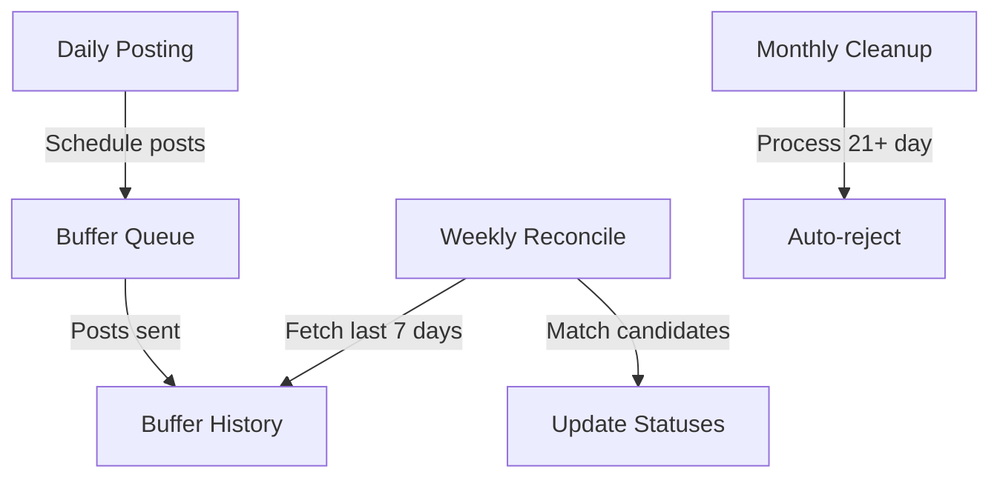

Here's the complete workflow with timing recommendations:

### Ideal Reconcile Workflow



### Key Timing

1. **Posting Phase** (Daily)
   
   - `python main.py --curate` generates candidates and schedules posts
   - Buffer sends posts at scheduled times

2. **Reconciliation Phase** (Weekly)
   
   - Run `python main.py --reconcile` every 7 days
   - Checks last week's Buffer history
   - Updates `selected` status for matched candidates

3. **Cleanup Phase** (Monthly)
   
   - Automatic during weekly reconcile
   - Candidates >21 days old without matches get `selected=False`

### Critical Path

```python
# services/selection_learning/_reconcile.py
now = datetime.now(timezone.utc)
cutoff = now - timedelta(days=21)  # 21-day window

if candidate["timestamp"] < cutoff:
    candidate["selected"] = False  # Auto-reject
```

### Best Practices

1. Run reconcile weekly on Mondays
2. For testing:
   
   ```bash
   # Simulate 22-day old candidate
   python -c "from datetime import datetime, timedelta; print((datetime.now() - timedelta(days=22)).isoformat())"
   ```
3. Monitor `data/selection/generated_candidates.jsonl`

Would you like me to prepare a cron job setup for this workflow?
