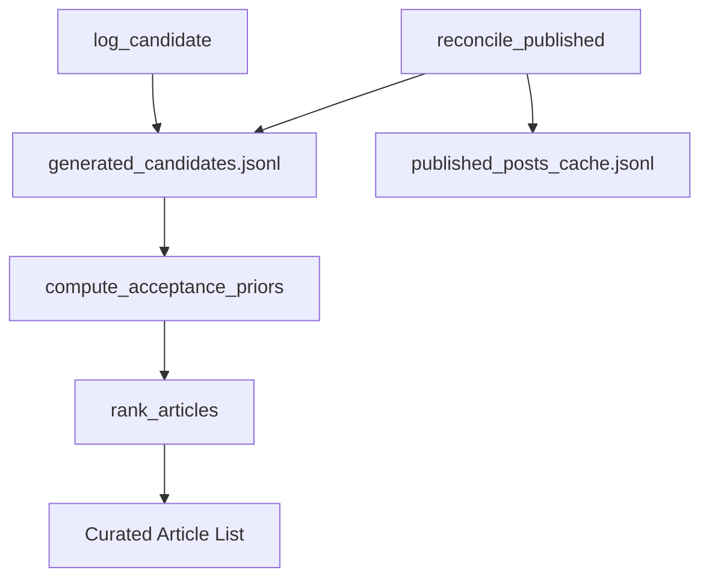
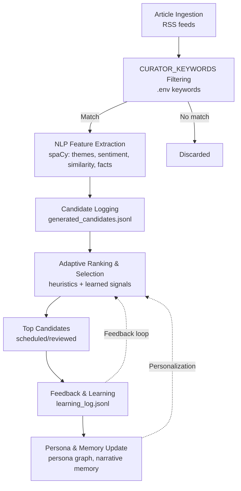
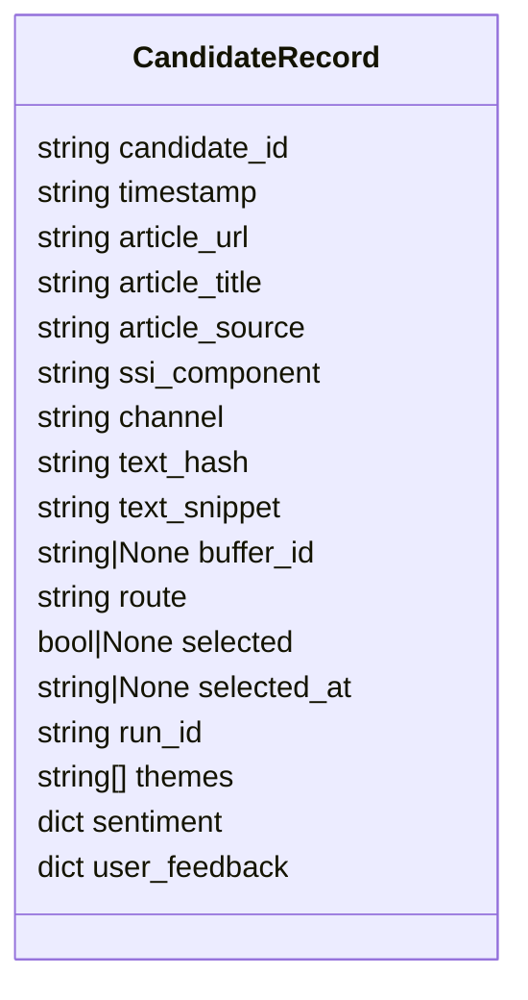
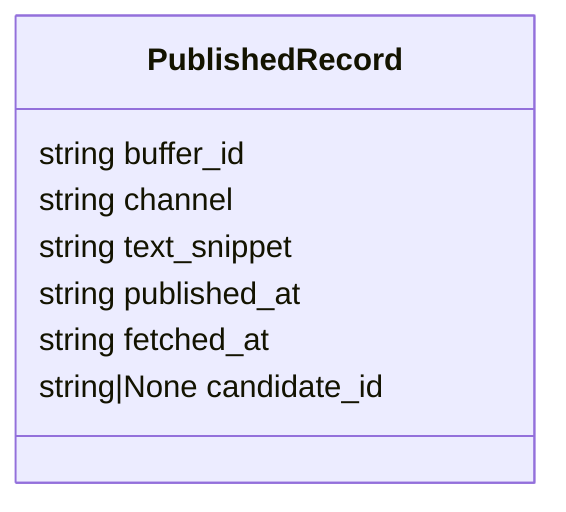

# Selection Learning

Adaptive selection learning is the mechanism that helps the curation pipeline prioritize sources and topics that are more likely to match actual publishing behavior. The system does this by logging candidates, reconciling them against published posts, and feeding acceptance rates back into future ranking.

---

## High-Level Architecture

---

## Key Components

### 1. Candidate Logging

- `log_candidate()`: Appends each generated post candidate to a JSONL log with metadata and hashes for matching.
- `update_candidate_buffer_id()`: Updates Buffer post IDs after publish.

### 2. Buffer Publish Reconciliation

- `reconcile_published()`: Fetches SENT posts from Buffer, upserts them into a published cache, and matches them to candidates using buffer_id, URL, or Jaccard similarity.
- Labels candidates as selected (True/False) based on match and acceptance window.

### 3. Acceptance Priors

- `compute_acceptance_priors()`: Computes Beta-smoothed acceptance rates for each (source, ssi_component) bucket, learning which sources/topics are most often selected.
- `get_acceptance_rate()`: Looks up acceptance rates for ranking.

### 4. Article Ranking

- `rank_articles()`: Scores and sorts RSS articles using a weighted blend of relevance (keyword match), freshness (recency), and acceptance prior (learned user preference).
- Formula:  
  $score = (1-\alpha) \times (0.5 \times relevance + 0.5 \times freshness) + \alpha \times acceptance\_rate$
- Ensures high-performing sources/topics float to the top over time.

---

## File: services/selection_learning.py

- All logic described above is implemented in this file.
- Entry points: `log_candidate()`, `reconcile_published()`, `compute_acceptance_priors()`, `rank_articles()`.

---

## How Article Selection and Adaptive Learning Work

1. **Article Fetch & CURATOR_KEYWORDS Filtering**
   - The system fetches articles from your configured RSS feeds.
   - It filters these articles using the keywords in `CURATOR_KEYWORDS` (case-insensitive, matches in title/content).
   - Only articles matching at least one keyword move to the next stage.

2. **Candidate Generation & Logging**
   - For each filtered article, the system generates one or more candidate posts (summaries, takes, etc.).
   - Each candidate is logged with all its metadata (see CandidateRecord schema).

3. **spaCy NLP Analysis**
   - Each candidate post is analyzed with spaCy to extract:
     - Themes/topics (NER, noun chunks)
     - Sentiment/tone
     - Semantic similarity (for deduplication/repetition)
   - These NLP features are added to the candidate record.

4. **Adaptive Ranking (Selection Learning)**
   - The system computes a ranking score for each candidate using:
     - **Acceptance priors** (how often you’ve published similar sources/topics/SSI components in the past)
     - **spaCy features** (theme match, repetition penalty, etc.)
     - **Freshness** (newer articles are favored)
     - **Keyword relevance** (from the original filter)
   - Candidates with higher scores are ranked higher.

5. **Confidence & Truth Gate**
   - Each candidate is scored for confidence (grounding, truthfulness, repetition).
   - The “truth gate” may remove unsupported claims or lower confidence for weakly grounded posts.
   - Confidence policy (from .env) determines if a candidate is scheduled, sent to Ideas, or blocked.

6. **Scheduling/Publishing**
   - The top-ranked, high-confidence candidates are scheduled for posting (via Buffer API).
   - Others may be sent to the Ideas board or dropped, depending on your confidence policy.

7. **Feedback Loop**
   - After publishing, the system reconciles which candidates were actually posted.
   - Acceptance priors are updated, so future curation runs adapt to your real publishing choices.

#### **Customising RSS feeds and keywords**

Both the RSS feed list and the keyword filter are configurable via `.env` — no code changes needed.
**`CURATOR_KEYWORDS`** — comma-separated terms matched against article titles/summaries (overrides built-in list entirely): CURATOR_KEYWORDS=RAG,LLM,neo4j,GovTech,Spring AI,MCP,vector search
**`CURATOR_RSS_FEEDS`** — JSON array of `{"name": "...", "url": "..."}` objects (overrides built-in list entirely): CURATOR_RSS_FEEDS=[{"name":"Anthropic Blog","url":"https://www.anthropic.com/rss.xml"},{"name":"My Blog","url":"https://myblog.com/feed.xml"}]
**`CURATOR_RSS_FEEDS_EXTRA`** / **`CURATOR_KEYWORDS_EXTRA`** — same formats, but **appended** to the active lists instead of replacing them. Use these to bolt on extra sources (e.g. the Japanese Shinjuku/Tokyo music feed set) while keeping the defaults. See [environment-variables.md](environment-variables.md#curator_rss_feeds_extra).

## Candidate logging

Every generated article candidate and post is logged to `data/selection/generated_candidates.jsonl` together with metadata such as source, topic, SSI component, route, and run ID. This creates the training signal for later reconciliation and ranking.

Below is a class diagram of the generated candidates structure (`generated_candidates.jsonl`):

If your Markdown viewer does not support Mermaid, see the schema fields above or refer to the example JSONL for structure.

## Reconciliation

Running `python main.py --reconcile` fetches published posts and matches them against logged candidates. The documented matching cascade is exact Buffer post ID first, then article URL, then Jaccard token similarity between generated and published text.

Candidates matched to published posts become `selected=True`, while candidates older than the 21-day acceptance window become `selected=False`; newer unmatched candidates stay pending as `selected=None`. These labels are then used to compute acceptance priors.

## Acceptance priors

The system computes a Beta-smoothed acceptance rate for each `(source, ssi_component)` bucket. On later curation runs, that prior becomes one of the ranking features alongside keyword relevance and freshness, helping preferred sources float upward over time.

## Learning Signals and spaCy NLP

##### Captured Attributes for Each Candidate

Each generated post candidate is logged with metadata such as:

- **Text snippet** (the generated post)
- **Candidate ID** (unique hash)
- **Article URL/source** (if curated from an article)
- **SSI component** (establish_brand, find_right_people, engage_with_insights, build_relationships)
- **Timestamp**
- **Selected status** (selected, rejected, or pending)
- **Buffer post ID** (if published)
- **Channel** (LinkedIn, X, Bluesky, etc.)
- **Route** (post, idea, block)
- **Run ID** (for tracking batch runs)
- **spaCy-extracted features** (see below)

#### Signals Used for Learning and Ranking

The learning and ranking system uses a combination of:

- **SSI component** (which pillar the post targets)
- **Source** (where the article or idea came from)
- **spaCy NLP features:**
  - **Themes/topics** (extracted via NER and noun chunking)
  - **Sentiment/tone** (rule-based, using spaCy tokenization)
  - **Semantic similarity** (for repetition detection and matching)
  - **Fact grounding** (matching claims to persona graph facts)
  - **Repetition score** (semantic similarity to recent posts, penalizes repeated content)
  - **Confidence signals** (from the truth gate, spaCy, and other heuristics)
- **Acceptance priors** (Beta-smoothed rate of selection for each (source, ssi_component) bucket)
- **User feedback** (if you upvote/downvote or override a candidate)

### spaCy’s Role

spaCy is used for:

- **Theme extraction** (NER + noun chunks)
- **Sentiment/tone analysis** (rule-based, token-level)
- **Semantic similarity** (vector-based, for repetition and matching)
- **Fact suggestion** (when the truth gate drops a claim, spaCy finds the closest persona fact)
- **Summarization** (for curated articles)

### Summary Table

| Attribute           | Source/Method      | Used for...                     |
| ------------------- | ------------------ | ------------------------------- |
| Text snippet        | Generated          | Matching, learning, reporting   |
| SSI component       | Candidate metadata | Acceptance priors, allocation   |
| Source/article URL  | Candidate metadata | Acceptance priors, matching     |
| Channel             | Candidate metadata | Channel-specific reconciliation |
| spaCy themes        | spaCy NER/chunks   | Learning, repetition, priors    |
| Sentiment/tone      | spaCy (rule-based) | Confidence, learning            |
| Semantic similarity | spaCy vectors      | Repetition, matching, learning  |
| Fact suggestion     | spaCy + persona    | Truth gate, learning            |
| Confidence signals  | Heuristics + spaCy | Routing, learning               |
| User feedback       | Manual/CLI         | Learning, priors                |

In short:
spaCy powers most of the NLP signals (themes, sentiment, similarity, fact suggestion) that drive learning, ranking, and post selection in the system. All these signals are logged and used to adapt future content and curation.

## Local files

The README identifies `data/selection/generated_candidates.jsonl` and `data/selection/published_posts_cache.jsonl` as local, auto-created, gitignored files. It also notes a local ideas cache whose path can be overridden with `IDEAS_CACHE_PATH` in `.env`.

Below is a class diagram of the published posts cache structure (`published_posts_cache.jsonl`):

If your Markdown viewer does not support Mermaid, see the schema fields above or refer to the example JSONL for structure.

## Workflow

A typical loop is: run `--curate`, review or publish outputs, run `--reconcile`, and let later curation runs incorporate those choices automatically. This keeps the ranking system grounded in user behavior instead of one-time keyword matching alone.
